- organisation
	- registration
	  collapsed:: true
		- open issues?
		- [[Modulprüfung]]?
	- introduction
	  collapsed:: true
		- What’s your background?
		- What interests you about lexis?
		  collapsed:: true
			- {{renderer excalidraw, excalidraw-2023-11-01-18-53-36}}
	- materials
	  collapsed:: true
		- ((65426ad4-e36e-41aa-8466-9b3556b4f770))
		- [[bibliography]]
	- requirements
	  collapsed:: true
		- {{embed [[requirements]]}}
	- course description
	  collapsed:: true
		- {{embed [[course description]]}}
	- course schedule
	  collapsed:: true
		- {{embed [[course schedule]]}}
- introduction to lexicology and lexicography
  collapsed:: true
	- What is lexicology about?
		- What is a *word*?
			- How many words?
			  collapsed:: true
				- *Paul was drinking beer in his favorite bar. He enjoyed having a drink every now and then. He thought he did not drink much, but his wife thought that he drank.*
				  collapsed:: true
					- 31?
					  collapsed:: true
						- |   | Type    | Token      |
						  |---|---------|------------|
						  | 1 | DRINK$^v$ | *drinking* |
						  |   |         | *drink*    |
						  |   |         | *drunk*    |
						  |---|---------|------------|
						  | 2 | DRINK$^n$ | *drink*    |
				- three notions of 'words'
				  collapsed:: true
					- types
					  collapsed:: true
						- lexemes, lexical items a listed in the dictionary, abstract units of the lexicon: WORK$^v$
					- word-forms
					  collapsed:: true
						- inflectional variants of lexemes: *(he) works*, *(he) worked*
					- tokens
					  collapsed:: true
						- concrete instantiations of types in running text, commonly delimited by whitespace
			- Model of the linguistic sign ([[deSaussure1916Cours]])
			  collapsed:: true
				- 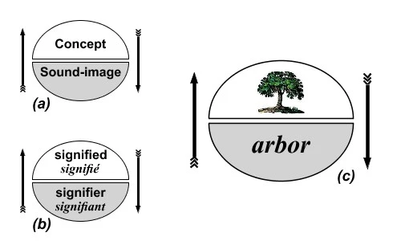
			- What is the function of words in communication?
			  collapsed:: true
				- Organon model ([[Buhler1934Sprachtheorie]])
				  collapsed:: true
					- 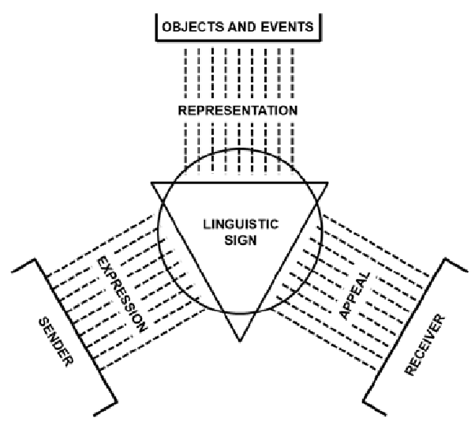
		- objective of lexicology
		  collapsed:: true
			- ((65426e70-9163-44c7-845e-f8620bba56a7))
	- What is the *lexicon*?
		- two senses of *lexicon*
		  collapsed:: true
			- {{embed ((65427395-0bec-45e5-96df-acc2a33e536d))}}
		- dimensions of structure in the lexicon
			- internal vs external
				- ((65427fa0-1844-4a45-8f57-245483e032ff))
			- paradigmatic vs syntagmatic
				- ((65427d85-d8e7-4b95-abca-f699ed24078a))
		- the function of lexicology in language
			- ((6542743b-f510-4190-a295-fe54436f31d7))
		- the [[mental lexicon]]
			- 
			- 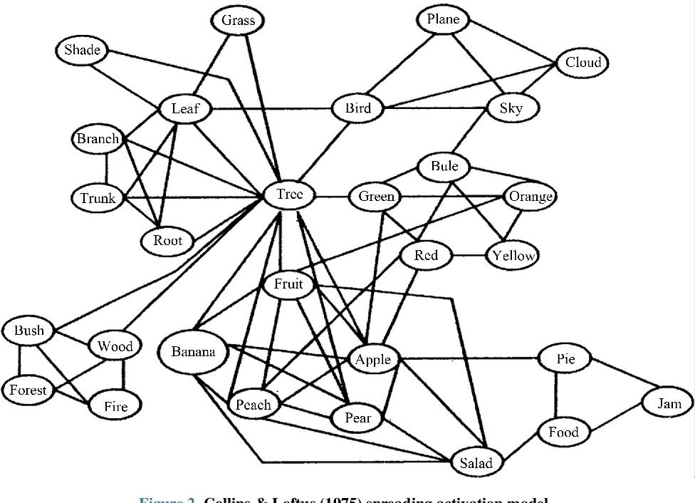
			- [[word embeddings]] ([[Bandyopadhyay2022Interactive]])
				- 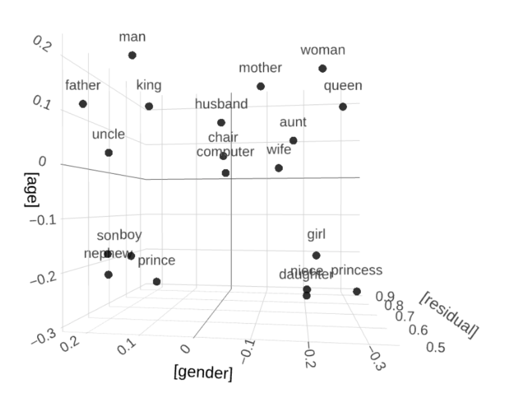
	- [[word-formation]]
		- [[inflection]] vs [[word-formation]] ([[Schmid2016EnglishMorphology]])
		  collapsed:: true
			- 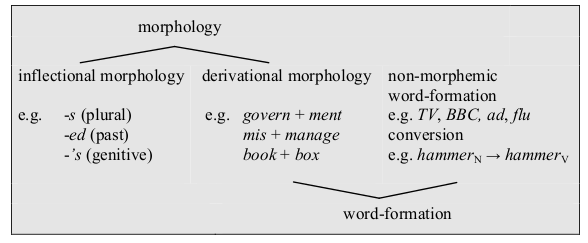
		- morphemic word-formation
			- overview
			  collapsed:: true
				- 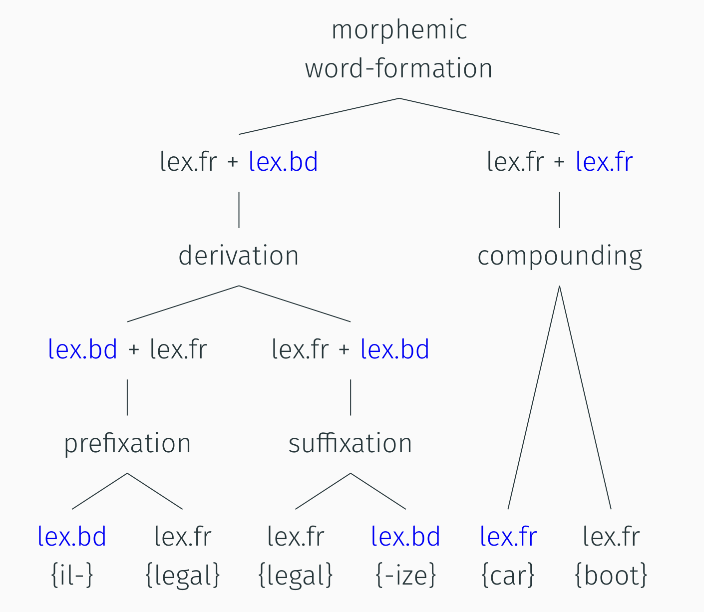
			- How many parts does the word *disclaimers* consist of?
			- How can we analyse this complex word in terms of its parts?
			- {{renderer excalidraw, excalidraw-2023-11-02-19-13-09}}
		- non-morphemic word-formation
			- 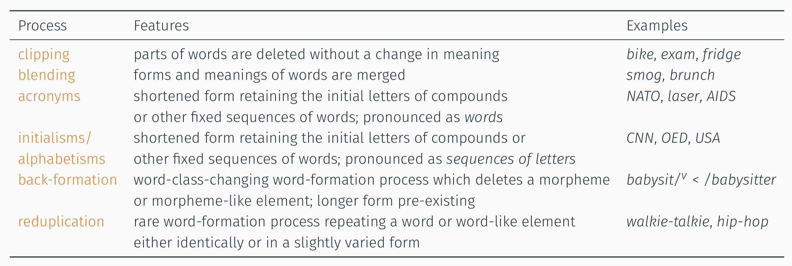
		- [[practice]]: Analyse the following words morphologically
			- *distasteful*
			  logseq.order-list-type:: number
			- *fridge*
			  logseq.order-list-type:: number
			- *washing machine*
			  logseq.order-list-type:: number
			- *sightsee*$^v$
			  logseq.order-list-type:: number
			- *friendship*
			  logseq.order-list-type:: number
			- *Brangelina*
			  logseq.order-list-type:: number
			- *lol*
			  logseq.order-list-type:: number
			- {{renderer excalidraw, excalidraw-2023-11-03-00-51-20}}
	- meaning
		- The Linguistic Triangle ([[Ogden1923MeaningMeaning]])
		  collapsed:: true
			- 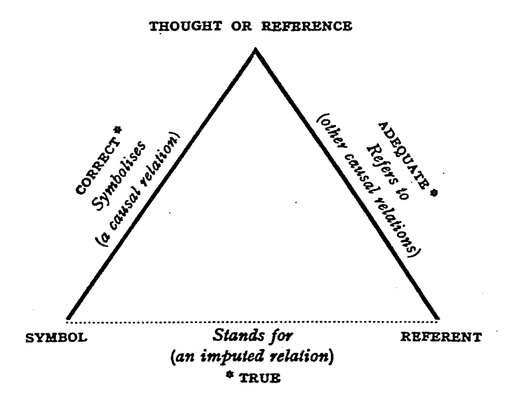
		- [[lexical relations]]
			- overview
			  collapsed:: true
				- 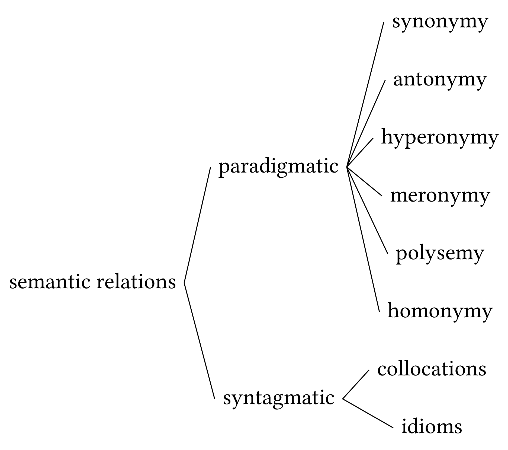
			- paradigmatic
			  collapsed:: true
				- ((65427ed2-14e4-4f54-a1e1-ee1e686eeb6a))
			- syntagmatic
			  collapsed:: true
				- definition
				  collapsed:: true
					- ((65427e11-e2cd-44a3-9ef7-4dcd76a05a6b))
			- [[paradigmatic relations]] vs [[syntagmatic relations]]
			  collapsed:: true
				- ((65427ef4-81da-4ce9-a846-03de8a1505e3))
			- [[collocations]] and [[idioms]]
			  collapsed:: true
				- 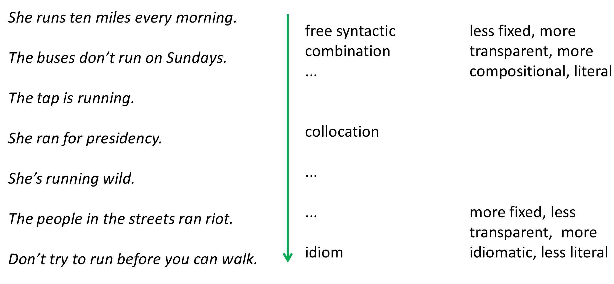
			- [[practice]]: [[lexical relations]]
				- *give* – *receive*
				  collapsed:: true
					- directional opposites
				- *freedom* – *liberty*
				  collapsed:: true
					- synonyms (descriptive)
				- *poor* – *rich*
				  collapsed:: true
					- antonyms: polar
				- *peace* – *war*
				  collapsed:: true
					- antonyms: complementary
				- *car* – *convertible*
				  collapsed:: true
					- hyperonym – hyponym
				- *house* – *cottage* – *palace*
				  collapsed:: true
					- co-hyponyms of *building*
				- *clear* – *conscience*
				  collapsed:: true
					- collocation
				- *It costs an arm and a leg.*
				  collapsed:: true
					- idiom
	- [[lexical change]]
		- [[language change]]
			- ((65428629-8dba-4540-9304-5a4bbc5ff43e))
			- [[Hamilton2016Diachronic]]
			  collapsed:: true
				- 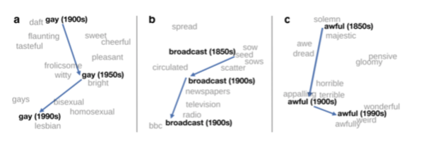{:height 162, :width 449}
		- [[lexical innovation]]
			- Why do we invent new words?
			  collapsed:: true
				- 
	- variation
		- the importance of variation
			- ((65427192-ad8c-47b7-b451-1a6f6544f72b))
		- dimensions of variation
			- overview
				- [[Kortmann2020English]]
				  collapsed:: true
					- 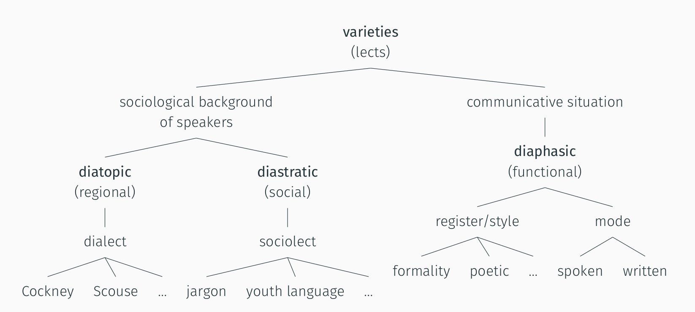
				- [[Lipka1992OutlineEnglish]]
					- ((6542869f-aa64-4e84-81d8-b484008a566a))
			- speaker groups
				- regional variation
				  collapsed:: true
					- dialect
					  collapsed:: true
						- ((65428353-1d92-4692-8637-1a5292d2038c))
					- [[Grieve2018MappingLexical]]
						- 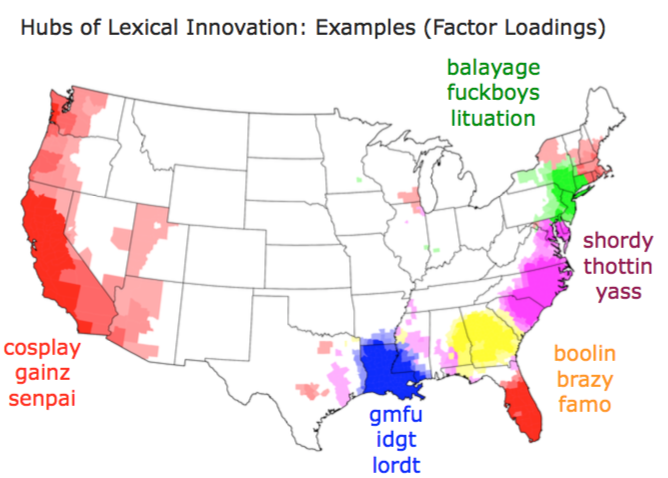
				- [[sociolect]]
					- ((6542846e-6dc2-411b-b715-cd318df3288b))
			- situational variation
				- register
					- ((65428396-7109-446e-b087-79b3a398b383))
- [[practice]]: using [dictionaries]([[dictionary]]) for studying lexis
  collapsed:: true
	- Which types of lexical information can you find in the [[OED]]?
		- usage (frequency): increases or decreases
		- phonology
		- morphology
		- semantics
		- sociolinguistics
		  collapsed:: true
			- *bro*
		- register
			- *furlough*$^v$