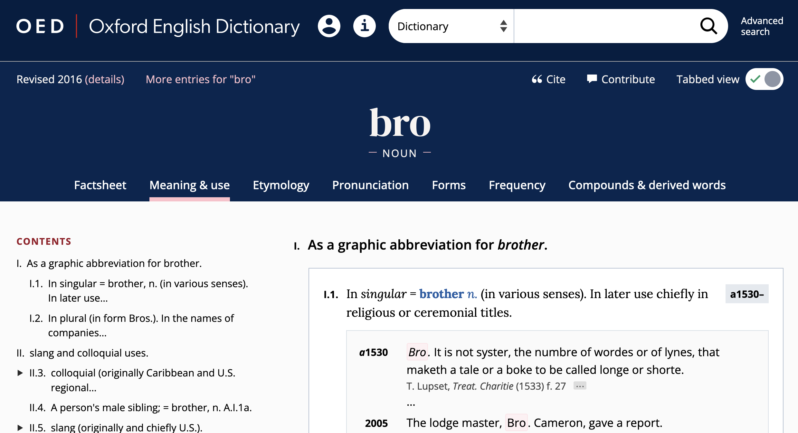
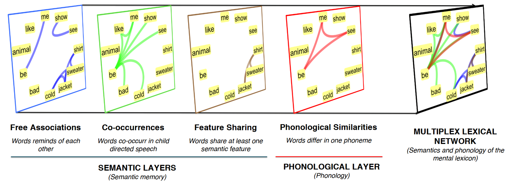
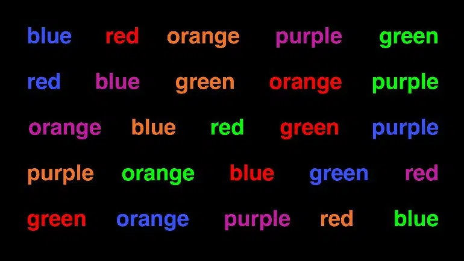

- words
	- How many words?
	  collapsed:: true
		- {{embed ((6544372d-42ba-4fbd-a0e2-7d47bec15009))}}
	- What is a word? ([[Bauer2022Introduction]])
	  collapsed:: true
		- criteria
		  collapsed:: true
			- utterance
			  collapsed:: true
				- collapsed:: true
				  > A word is the smallest unit which can stand on its own as an utterance.
					- p. 1
				- but
				  collapsed:: true
					- mentioning
					  collapsed:: true
						- A: *Is it ‘inadvisable’ or ‘unadvisable’?*
						- B: *Un.*
					- grammatical words: e.g. *the*
			- phonology
			  collapsed:: true
				- collapsed:: true
				  > A word is a unit which, when pronounced in isolation, has a single intonational focus point, or movement of pitch.
					- p. 2
				- but
				  collapsed:: true
					- *in the beginning* vs *first*
			- meaning
			  collapsed:: true
				- collapsed:: true
				  > A word has a single, unitary meaning.
					- p. 2
				- but
				  collapsed:: true
					- *finally* vs *in the end*
			- dictionary entry
			  collapsed:: true
				- collapsed:: true
				  > A word is listed in the dictionary.
					- p. 2
				- but
				  collapsed:: true
					- circular reasoning: words are listed *because* they are words
					- dictionaries also list smaller units (e.g. prefix like *un-*)
			- spelling
			  collapsed:: true
				- > words are unitary orthographic units
				- but
				  collapsed:: true
					- *coffee pot* vs *coffee-pot*
					- *in so far as* vs *in-so-far-as*
					- diachronic change: *all right* vs *alright*
		- practical definition
		  collapsed:: true
			- collapsed:: true
			  > […] in general we will accept the spelling conventions of English as defining words. This might not be terribly scientific, but it has the advantage of being practical.
				- p. 3
	- further reading: [[Haspelmath2023Defining]]
	  collapsed:: true
		- ((65491c04-2444-4b8d-9f5b-91b6a04ebb0c))
	- problems in delineating the term *word*
	  collapsed:: true
		- names
		  collapsed:: true
			- > A word is a linguistic item which helps us discuss the world around us. It is a unit which not only has form (a phonological structure or an orthographic one), but also meaning. In this sense, names are words. But names are different from other words in a number of ways.
			- reference
			  collapsed:: true
				- > They have unique reference, *Samantha* refers to one particular person in a given context, *tree* refers to a set of items, one or more of which is relevant in the given context.
				- ((6544372d-c654-4fa9-a9c2-9fbaebee101c))
				- definite reference:
					- **the Samantha*
					- *This is not the Paris I used to now.*
						- use as a common noun
				- roles as noun phrases
					- no modifiers
						- *the former Argentine*
				-
		- [[multi-word expressions]] (MWE)
		  collapsed:: true
			- [[compounds]]
			  id:: 654a54f8-f453-4b78-8286-be3dd876a8e1
			  collapsed:: true
				- *passion flower*
				- *sunflower*
				- *wall-flower*
				- [[onomasiological competition]] between [[formal varians]]
				  tags:: [[term paper idea]]
					- *honey bee*
					- *honeybee*
			- [[phrasal verbs]]
			  id:: 654a551c-659c-446f-80a6-638c4e9724c2
			  collapsed:: true
				- *He __passed out__.*
				- *He __fainted__.*
			- [[idioms]]
			  id:: 654a553f-6aa5-41e4-b1f0-d5800969719a
			  collapsed:: true
				- *He __kicked the bucket__.*
				- *He __died__.*
			- [[proverbs]]
			  id:: 654a5600-588e-4a26-bbaf-fdb09a5e6069
			  collapsed:: true
				- *Too many cooks spoil the broth.*
				- **The broth has been spoilt by too many cooks.*
			- [[collocations]]
			  id:: 654a562d-978b-4bb4-85f7-5e879a4f5dc1
			  collapsed:: true
				- collocation continuum
					- strong collocations
					  collapsed:: true
						- *kith and kin*
							- *kith*: unique morph
					- intermediate
					  collapsed:: true
						- *all things considered*
						- *as a matter of fact*
						- *excuse me*
						- *good afternoon*
						- *I’m sorry to say*
						- *in other words*
						- *in the long run*
					- weak collocations
					  collapsed:: true
						- *in the*
		- paradigms
		  collapsed:: true
			- > The term ‘paradigm’ is in general usage, but its usage is often limited. Although paradigm can justafiably be used of any substitution class, it is most often used of substitution classes within the word. Thus the normal use for the term ‘paradigm’ is the kind of substitution class illustrated in ((654a5862-20e5-446c-8836-a4cdb578efad)).
			- (12)
			  id:: 654a5862-20e5-446c-8836-a4cdb578efad
				- *walk*
				- *walks*
				- *walked*
				- *walking*
			- > This paradigm illustrates two different kinds of word: there is a sense in which all the items in ((654a5862-20e5-446c-8836-a4cdb578efad)) are different words, which we will call [[word-forms]], and a contrasting sense in which the paradigm in ((654a5862-20e5-446c-8836-a4cdb578efad)) illustrates different uses of the same word, which we will call a [lexeme]([[lexemes]]).
			- [derivational]([[derivation]]) paradigms
				- (13)
				  id:: 654a5995-9dbd-4ed5-95fd-fffea0e80e77
				  collapsed:: true
					- a
						- *deceive*
						- *deception*
						- *deceptive*
					- b
						- *employ*
						- *employer*
						- *employee*
					- c
						- *proceed*
						- *process*
						- *processual*
					- d
					  id:: 654a591a-cac1-44a7-8231-9713905ab3a3
						- *theory*
						- *theorist*
						- *theorise*
				- > Although the examples in ((654a5995-9dbd-4ed5-95fd-fffea0e80e77)) show individual sets of words, these series are often generalised over several word families, in the sense that ((654a591a-cac1-44a7-8231-9713905ab3a3)), for example, is just one [[word family]] whose overall pattern is also illustrated by *fantasy*, *fantasist*, *fantasise*.
- [dictionaries]([[dictionary]]) ([[Bauer2022Introduction]])
	- [[definition]]
	  collapsed:: true
		- > The term ‘dictionary’ is usually restricted to real-world dictionaries that appear in print and online. Dictionaries provide a list of words of whatever language they deal with — in our case, English — and then give a certain amount of information about each of them. Dictionaries tend to have two functions, which may, on occasions, conflict with each other:
			- > to describe the language as it is,
			- > and to provide an influence for establishing and maintaining the standard form of the language.
	- [[descriptivism]] vs [[prescriptivism]]
	  collapsed:: true
		- > If we assume that one of *ˈkilometre* and *kiˈlometre* is right (and the other, therefore, wrong), we assume that there is a unique solution to this question of English usage. We assume that it is a question like *Should you drive on the right or on the left in England?* where there is a single solution laid down by law. We assume it is not like *Should I wear jeans to the party tonight?* where the answer may depend on your age, the dress code for the party, how good you think you look in jeans, whether you prefer to be underdressed or overdressed for any occasion, what else you have to wear, the kind of party that is involved, where the party is being held and so on.
		- > Language questions are more often like the jeans queston, and less often like the driving-side question. Whatever answer the person you have asked gives you, there will be somebody else, apparently equally authoritative, who will give you a different answer.
		- 
	- proof of the existence of words
	  collapsed:: true
		- > First of all, dictionaries provide evidence of the existence of a word. The fact that a word is listed in a dictionary at all is taken to prove that there is such a word. This can be misleading in two ways.
			- > From time to time, dictionaries list words erroneously, and the word has no existence outside the dictionary. The OED gives a list of such spurious words including *banket* (‘a term in bricklaying’), *David's staff* (‘a navigational instrument) and *sardel*, variously supposed to be a fish (the sardine) or a precious stone.
			- > Dictionaries far more often fail to list perfectly good words. This is inevitable. No dictionary can list every word of English
		- [[term paper idea]]
			- Which words are commonly used (in corpora), but not contained in dictionaries?
			- Which words are contained in dictionaries, but are not commonly used (in corpora)?
	- information provided
	  collapsed:: true
		- example: *bro* in the [[OED]]
			- 
		- spelling
			- *judgement* vs *judgment*
		- pronunciation
		- meaning
		- grammatical information
		- examples of usage
		- etymology
- the lexicon
	- two senses of *lexicon*
	  collapsed:: true
		- {{embed ((6544372d-dec9-47cb-ab66-644834726315))}}
	- objective of lexicology
	  collapsed:: true
		- {{embed ((654287ed-518d-4b83-bd3f-7f317c646ca8))}}
	- [[definition]] ([[Bauer2022Introduction]])
	  collapsed:: true
		- > The lexicon is what linguists call the dictionary that is assumed to be in people’s heads, or the linguist’s best approximation to that. That is, it is fundamentally a psychological entity, and correspondingly, its contents cannot be observed directly, but must be deduced from speakers’ and hearers’ behaviour. There are two fundamental approaches to the lexicon.
			- > The first is that, in the slogan, the lexicon is the home of the lawless (Di Sciullo and Williams 1987): that is, the lexicon contains whatever cannot be predicted by general rule.
			- > The second, wider, approach sees the lexicon as not only containing the lawless, but also
			  containing anything to do with the structure of words, whether it is lawless or not.
	- the [[mental lexicon]]
	  collapsed:: true
		- a cognitive view
		  collapsed:: true
			- 
		- cognitive-linguistic models of the lexicon
		  collapsed:: true
			- 
		- [[word embeddings]] ([[Bandyopadhyay2022Interactive]])
		  collapsed:: true
			- 
	- associations in the lexicon
	  collapsed:: true
	  :LOGBOOK:
	  CLOCK: [2023-11-08 Wed 13:58:37]--[2023-11-08 Wed 13:59:01] =>  00:00:24
	  CLOCK: [2023-11-08 Wed 13:59:24]
	  :END:
		- 
			- [[Stella2019Modelling]]
		- types of associations ([[Bauer2022Introduction]])
		  collapsed:: true
			- meaning
			- form
				- pronunciation
				- spelling
			- variation in use
		- The Stroop Effect ([[Stroop1935Studies]])
		  collapsed:: true
			- 
		- Freudian slip ([[Bauer2022Introduction]])
		  collapsed:: true
			- > > If you talk to someone about electricity, and then make them read the phrase *sham dock*, they might very well say *damn shock*, because of the prior activation of words associated with electricity; and the phenomenon of the Freudian slip depends upon a subject area being readily activated in the brain, and brought out invertently, whether because of a word related in meaning or related in pronunciation.
- [[practice]] using the [[OED]]
  collapsed:: true
	- questions
		- Which types of ‘problematic cases’ of words do you find in the OED?
		- How is the ‘atypical information’ listed?
	- candidate types
		- ((654a54f8-f453-4b78-8286-be3dd876a8e1))
		- ((654a551c-659c-446f-80a6-638c4e9724c2))
		- ((654a553f-6aa5-41e4-b1f0-d5800969719a))
		- spelling variation
		  collapsed:: true
			- *judgemental* vs *judgmental*
		- ((654a5600-588e-4a26-bbaf-fdb09a5e6069))
		- ((654a562d-978b-4bb4-85f7-5e879a4f5dc1))