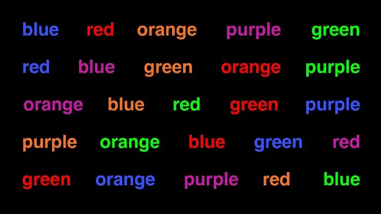
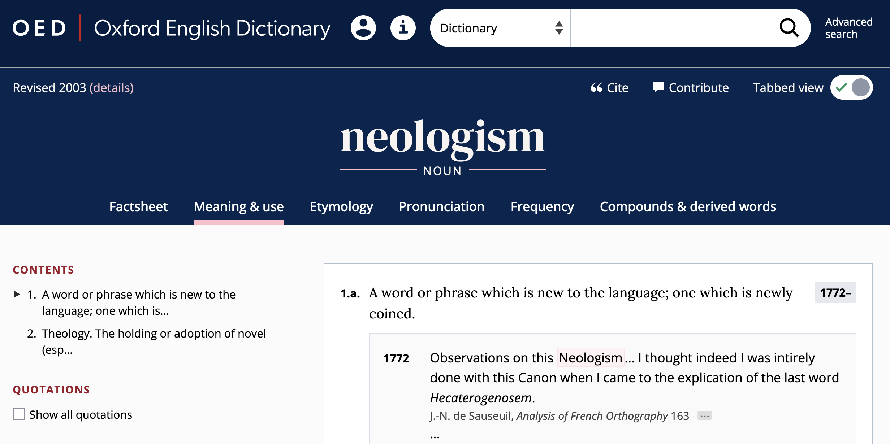

- the lexicon
	- two senses of *lexicon*
		- {{embed ((6544372d-dec9-47cb-ab66-644834726315))}}
	- objective of lexicology
		- {{embed ((654287ed-518d-4b83-bd3f-7f317c646ca8))}}
	- [[definition]] ([[Bauer2022Introduction]])
		- > The lexicon is what linguists call the dictionary that is assumed to be in people’s heads, or the linguist’s best approximation to that. That is, it is fundamentally a psychological entity, and correspondingly, its contents cannot be observed directly, but must be deduced from speakers’ and hearers’ behaviour. There are two fundamental approaches to the lexicon.
			- > The first is that, in the slogan, the lexicon is the home of the lawless (Di Sciullo and Williams 1987): that is, the lexicon contains whatever cannot be predicted by general rule.
			- > The second, wider, approach sees the lexicon as not only containing the lawless, but also
			  containing anything to do with the structure of words, whether it is lawless or not.
	- the [[mental lexicon]]
		- a cognitive view
			- 
		- cognitive-linguistic models of the lexicon
			- 
		- [[word embeddings]] ([[Bandyopadhyay2022Interactive]])
			- 
			- https://projector.tensorflow.org/
				- 
	- associations in the lexicon
	  :LOGBOOK:
	  CLOCK: [2023-11-08 Wed 13:58:37]--[2023-11-08 Wed 13:59:01] =>  00:00:24
	  CLOCK: [2023-11-08 Wed 13:59:24]
	  :END:
		- 
			- [[Stella2019Modelling]]
		- types of associations ([[Bauer2022Introduction]])
			- meaning
			- form
				- pronunciation
				- spelling
			- variation in use
		- The Stroop Effect ([[Stroop1935Studies]])
			- 
		- Freudian slip ([[Bauer2022Introduction]])
			- > > If you talk to someone about electricity, and then make them read the phrase *sham dock*, they might very well say *damn shock*, because of the prior activation of words associated with electricity; and the phenomenon of the Freudian slip depends upon a subject area being readily activated in the brain, and brought out invertently, whether because of a word related in meaning or related in pronunciation.
- [dictionaries]([[dictionary]]) ([[Bauer2022Introduction]])
	- What is a word?
		- {{embed ((65491e9b-279c-4c64-8449-bb9887725e8b))}}
		- {{embed ((65491fa0-8899-4988-b352-35206d19517c))}}
	- [[definition]]
		- > The term ‘dictionary’ is usually restricted to real-world dictionaries that appear in print and online. Dictionaries provide a list of words of whatever language they deal with — in our case, English — and then give a certain amount of information about each of them. Dictionaries tend to have two functions, which may, on occasions, conflict with each other:
			- > to describe the language as it is,
			- > and to provide an influence for establishing and maintaining the standard form of the language.
	- [[descriptivism]] vs [[prescriptivism]]
		- > If we assume that one of *ˈkilometre* and *kiˈlometre* is right (and the other, therefore, wrong), we assume that there is a **unique solution** to this question of English usage.
			- > We assume that it is a question like *Should you drive on the right or on the left in England?* where there is a single solution laid down by law.
			- > We assume it is not like *Should I wear jeans to the party tonight?* where the answer may depend on your age, the dress code for the party, how good you think you look in jeans, whether you prefer to be underdressed or overdressed for any occasion, what else you have to wear, the kind of party that is involved, where the party is being held and so on.
		- > Language questions are more often like the jeans queston, and less often like the driving-side question. Whatever answer the person you have asked gives you, there will be somebody else, apparently equally authoritative, who will give you a different answer.
		- 
	- proof of the existence of words
		- > First of all, dictionaries provide evidence of the existence of a word. The fact that a word is listed in a dictionary at all is taken to prove that there is such a word. This can be misleading in two ways.
			- > From time to time, dictionaries **list words erroneously**, and the word has no existence outside the dictionary. The OED gives a list of such spurious words including *banket* (‘a term in bricklaying’), *David's staff* (‘a navigational instrument) and *sardel*, variously supposed to be a fish (the sardine) or a precious stone.
			- > Dictionaries far more often **fail to list perfectly good words**. This is inevitable. No dictionary can list every word of English
		- [[term paper idea]]
			- Which words are commonly used (in corpora), but not contained in dictionaries?
			- Which words are contained in dictionaries, but are not commonly used (in corpora)?
	- information provided
		- example: *bro* in the [[OED]]
			- 
		- spelling
			- *judgement* vs *judgment*
		- pronunciation
		- meaning
		- grammatical information
		- examples of usage
		- etymology
	- dictionaries
		- overview
		- [[Urban Dictionary]]
			- https://www.urbandictionary.com/
			- 
		- [[Wiktionary]]
			- https://www.wiktionary.org/
			- 
			- [[WIND]]
				- [[Sajous2020ENGLAWI]]
					- ((65553c13-f791-43fa-8be1-26fe6638f94c))
				- http://redac.univ-tlse2.fr/lexiques/wind.html
				- 
				- 
				- https://1drv.ms/x/s!AvkgNVl9yS6aoXzCgrowdEwy2LMV
		- [[OED]]
			- 
			- advanced search
				- 
- [[practice]]: investigating lexical innovation since 2000 using the [[OED]]
	- use the advanced search to find all lexemes whose first use is after 2000
		- 
	- export the results to a `csv` file
	- analyse the exported file in [[Microsoft Excel]]
		- questions
			- Which word-formation processes are most frequent?
			- Which word classes are most frequent?
			- Which subject areas are most frequent?
		- steps
			- create a `Table` containing the data
				- select the region containing the data
				- click on `Insert Table`
			- create a `Pivot Table` to analyse the data
				- see demo
		- model file: https://1drv.ms/x/s!AvkgNVl9yS6aoX4YgazKPYZGog54
	-