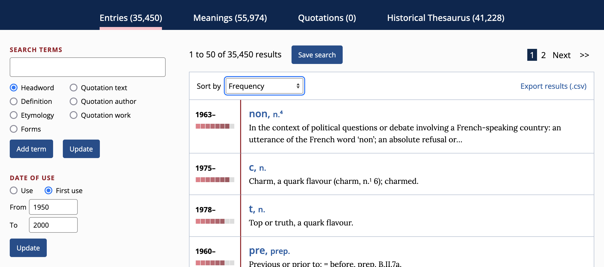
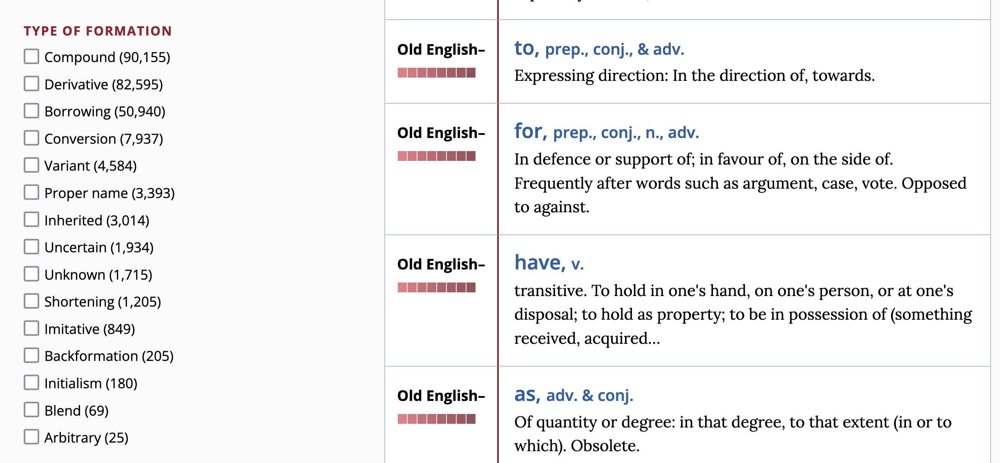
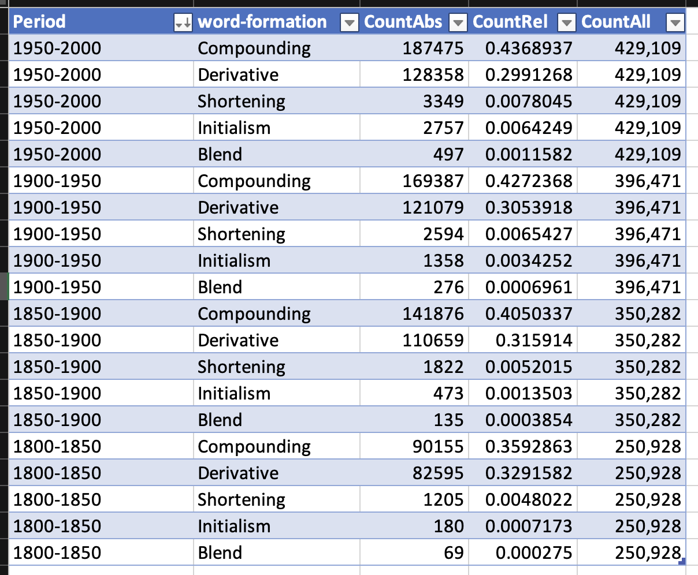
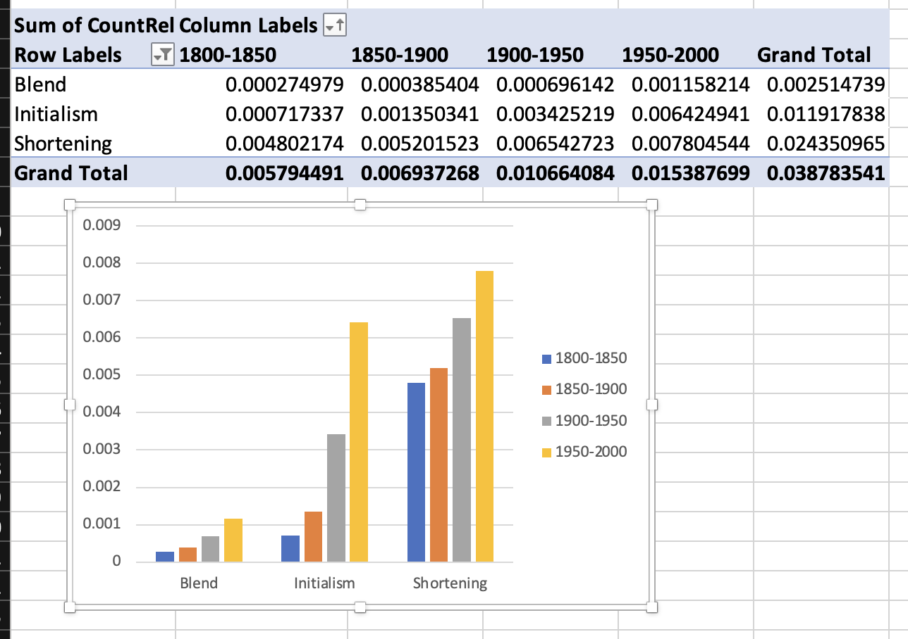

- dictionaries
	- {{embed ((654a60d8-23e3-4ff7-bef4-2456ff047eb3))}}
	- useful dictionaries
		- {{embed ((65553556-d2aa-4094-af92-66005f5e9701))}}
		- [[Wiktionary]]
		  collapsed:: true
			- ((65553b8c-d0ac-457e-ac10-ae8d639c476a))
		- {{embed ((65553565-f800-44b7-b53f-b63eaa68c827))}}
- data analysis using [[Microsoft Excel]]
	- general recommendations
		- tutorials: https://sfla.ch/tutorials/excel/
	- {{embed ((65553569-77c5-4153-a348-ce7175770b70))}}
	- [[practice]]: Which word-formation were used the most since 1800? ([[OED]])
	  collapsed:: true
		- selected word-formation processes
			- Compounding
			- Derivative
			- Shortening
			- Initialism
			- Blend
		- time windows
			- 1950-2000
			- 1900-1950
			- 1850-1900
			- 1800-1850
		- advanced search: extract numbers
			- 
			- 
		- analysis in [[Microsoft Excel]]
			- model sheet: https://1drv.ms/x/s!AvkgNVl9yS6aogJbsZreWu2ZsRzT
			- data sheet
				- 
			- pivot analysis & chart
				- 