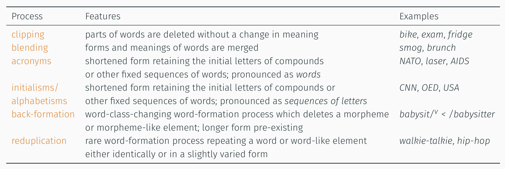

- [[inflection]] vs [[word-formation]] ([[Schmid2016EnglishMorphology]])
  collapsed:: true
	- 
- morphemic word-formation
  collapsed:: true
	- overview
		- 
	- How many parts does the word *disclaimers* consist of?
	- How can we analyse this complex word in terms of its parts?
	- {{renderer excalidraw, excalidraw-2023-11-02-19-13-09}}
- non-morphemic word-formation
  collapsed:: true
	- 
- [[practice]]: Analyse the following words morphologically
  collapsed:: true
	- *distasteful*
	  logseq.order-list-type:: number
	- *fridge*
	  logseq.order-list-type:: number
	- *washing machine*
	  logseq.order-list-type:: number
	- *sightsee*$^v$
	  logseq.order-list-type:: number
	- *friendship*
	  logseq.order-list-type:: number
	- *Brangelina*
	  logseq.order-list-type:: number
	- *lol*
	  logseq.order-list-type:: number
	- {{renderer excalidraw, excalidraw-2023-11-03-00-51-20}}