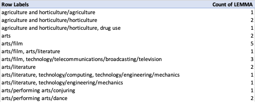
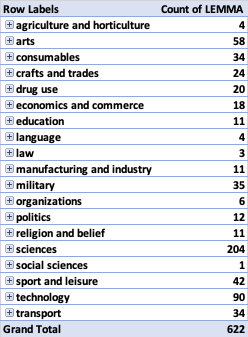
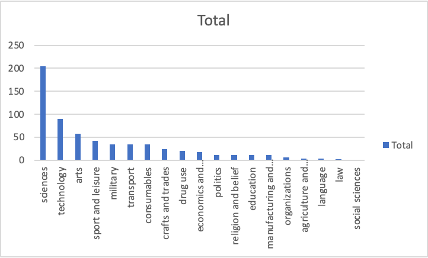

- theory
	- [[lexical innovation]]
	  collapsed:: true
		- types of neologisms
		  collapsed:: true
			- [[Kerremans2015Web]]
			  collapsed:: true
				- {:height 184, :width 316}
	- [[morphology]] vs [[word-formation]] ([[Schmid2016EnglishMorphology]])
	  collapsed:: true
		- 
	- inflection
	  collapsed:: true
		- Which inflectional morphemes exist in Present-Day English?
		  collapsed:: true
			- [[Schmid2016EnglishMorphology]]
			  collapsed:: true
				- {:height 250, :width 497}
	- morphological building blocks
	  collapsed:: true
		- [[Schmid2016EnglishMorphology]]
		  collapsed:: true
			- {:height 644, :width 458}
	- morphemic word-formation
	  collapsed:: true
		- overview of morphemic word-formation processes
		  collapsed:: true
			- {:height 350, :width 374}
		- [[practice]]: morphological analysis: *disclaimers*
		  collapsed:: true
			- How many parts does the word *disclaimers* consist of?
			- How can we analyse this complex word in terms of its parts?
			  collapsed:: true
				- {{renderer excalidraw, excalidraw-2023-11-02-19-13-09}}
	- non-morphemic word-formation
	  collapsed:: true
		- 
		- zero-derivation/conversion vs derivation
		  collapsed:: true
			- {:height 233, :width 485}
		- [[compounding]] vs [[blending]]
		  collapsed:: true
			- [[compounding]]
			  collapsed:: true
				- 
			- [[Kemmer2003Schemas]]
			  collapsed:: true
				- 
				  collapsed:: true
					- *swooshtika*
					  collapsed:: true
						- ‘derogatory reference to Nike swoosh logo’
						- [**SW**OOSH x **SW**asTIKA]
				- 
	- differences between morphemic and non-morphemic word-formation
	  collapsed:: true
		- {:height 310, :width 575}
	- further reading
	  collapsed:: true
		- [[Bauer2022Introduction]]
		- [[Lipka2002EnglishLexicology]]
- [[practice]]: Analyse the following words morphologically
  collapsed:: true
	- *distasteful*
	  logseq.order-list-type:: number
	  collapsed:: true
	- *fridge*
	  logseq.order-list-type:: number
	  collapsed:: true
	- *washing machine*
	  logseq.order-list-type:: number
	  collapsed:: true
	- *sightsee*$^v$
	  logseq.order-list-type:: number
	  collapsed:: true
	- *friendship*
	  logseq.order-list-type:: number
	  collapsed:: true
	- *Brangelina*
	  logseq.order-list-type:: number
	  collapsed:: true
	- *lol*
	  logseq.order-list-type:: number
	  collapsed:: true
	- {{renderer excalidraw, excalidraw-2023-11-03-00-51-20}}
- [[practice]]: Studying word-formation in the [[OED]]
	- [[shortening]]: Which semantic domains are most common among shortenings?
	  collapsed:: true
		- advanced search
		  collapsed:: true
			- 
			  collapsed:: true
				- [URL](https://www.oed.com/search/advanced/Entries?typeOfFormation=shortening&textTermOpt0=WordPhrase&dateOfUseFirstUse=false&page=1&sortOption=DateNewFirst)
		- [[Microsoft Excel]]
		  collapsed:: true
			- model file
			  collapsed:: true
				- https://1drv.ms/x/s!AvkgNVl9yS6aogTnf49W66DfUSYZ
			- create `Table`
			  collapsed:: true
				- 
			- create `Pivot Table`
			  collapsed:: true
				- 
			- group on the top level of categories
			  collapsed:: true
				- 
			- create pivot chart
			  collapsed:: true
				- 
			-
	- compare these findings with [[compounding]]