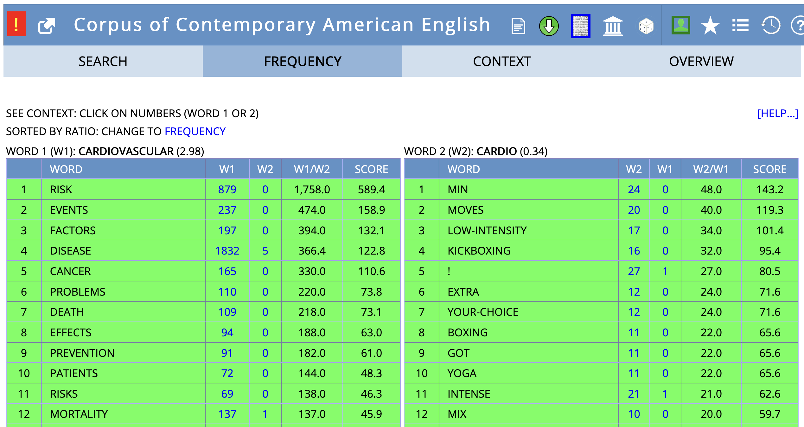

- The Linguistic Triangle ([[Ogden1923Meaning]])
  collapsed:: true
	- 
	  id:: 6544372d-c654-4fa9-a9c2-9fbaebee101c
- [[lexical relations]]
  collapsed:: true
	- overview
		- 
	- paradigmatic
		- ((65427ed2-14e4-4f54-a1e1-ee1e686eeb6a))
	- syntagmatic
		- definition
			- ((65427e11-e2cd-44a3-9ef7-4dcd76a05a6b))
	- [[paradigmatic relations]] vs [[syntagmatic relations]]
		- ((65427ef4-81da-4ce9-a846-03de8a1505e3))
	- [[collocations]] and [[idioms]]
		- 
	- [[practice]]: [[lexical relations]]
		- *give* – *receive*
			- directional opposites
		- *freedom* – *liberty*
			- synonyms (descriptive)
		- *poor* – *rich*
			- antonyms: polar
		- *peace* – *war*
			- antonyms: complementary
		- *car* – *convertible*
			- hyperonym – hyponym
		- *house* – *cottage* – *palace*
			- co-hyponyms of *building*
		- *clear* – *conscience*
			- collocation
		- *It costs an arm and a leg.*
			- idiom
- [[Hilpert2023Meaning]]
	- [[practice]]
		- [[collocations]]
			- 