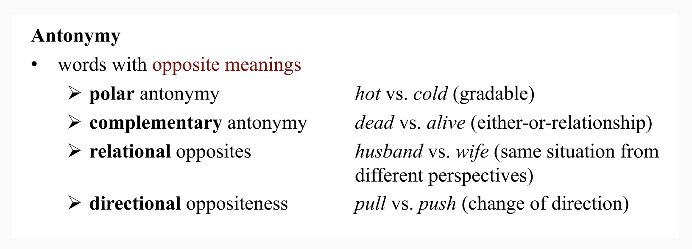
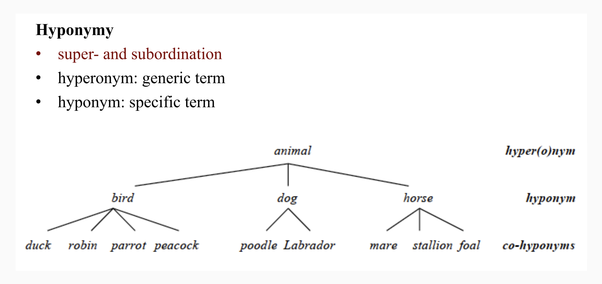

- semantic fundamentals
  collapsed:: true
	- model of the linguistic sign
	  collapsed:: true
		- {{embed ((6544372d-50ea-40d7-8082-30e0057fd539))}}
	- [[lexical relations]]
	  collapsed:: true
		- overview
		  collapsed:: true
			- 
		- paradigmatic
			- definition
			  collapsed:: true
				- ((65427ed2-14e4-4f54-a1e1-ee1e686eeb6a))
			- synonymy
			  collapsed:: true
				- 
			- antonymy
			  collapsed:: true
				- 
			- hyponymy
			  collapsed:: true
				- 
			- meronymy
			  collapsed:: true
				- 
			- polysemy
			  collapsed:: true
				- 
			- homonymy
			  collapsed:: true
				- 
			- polysemy vs homonymy
			  collapsed:: true
				- 
		- syntagmatic
			- definition
			  collapsed:: true
				- ((65427e11-e2cd-44a3-9ef7-4dcd76a05a6b))
			- [[collocations]] and [[idioms]]
			  collapsed:: true
				- 
				- 
		- [[paradigmatic relations]] vs [[syntagmatic relations]]
		  collapsed:: true
			- ((65427ef4-81da-4ce9-a846-03de8a1505e3))
		- [[practice]]: [[lexical relations]]
		  collapsed:: true
			- *give* – *receive*
				- directional opposites
			- *freedom* – *liberty*
				- synonyms (descriptive)
			- *poor* – *rich*
				- antonyms: polar
			- *peace* – *war*
				- antonyms: polar
			- *car* – *convertible*
				- hyperonym – hyponym
			- *building* → *house* – *cottage* – *palace*
				- co-hyponyms of *building*
			- *clear* – *conscience*
				- collocation
			- *It costs an arm and a leg.*
				- idiom
	- [[semantic change]]
	  collapsed:: true
		- 
		- the example of *silly*
			- 
- studying the meaning of clippings vs source forms ([[Hilpert2023Meaning]])
  collapsed:: true
	- design
		- good model for your [[term paper]] projects
	- background
		- {{embed ((645a1b9e-f78b-46c6-a43e-262f285a67d2))}}
		- {{embed ((6571ffc8-8203-476c-b186-12b045460a4e))}}
		- {{embed ((6571ffc8-c600-478a-a693-b6438612d82c))}}
	- data
		- {{embed ((645a1d76-e12f-450a-86b2-e69ccea0890f))}}
	- results
		- {{embed ((645a2b02-c578-4edc-b121-f5bca5a76389))}}
- [[practice]]: studying [[semantics]] in the [[COCA]]
  id:: 657b19fe-cbfb-4914-b620-c87af6ff0101
	- differences between [clippings]([[clipping]]) and source forms ([[Hilpert2023Meaning]])
		- task
			- Which of the [pairs of blends](((645a2870-9ab6-4a81-941d-44fe6a3c121a))) exhibits a difference in meaning?
			- What is the nature of the semantic variation between source forms and clipped forms?
		- use [[collocations]] to analyse meaning
		  collapsed:: true
			- 
			- 
	- differences in meaning between text types
	  collapsed:: true
		- example: *problem*
			- {:height 461, :width 380}
			- 
			  id:: 658461e0-86b0-4bc0-b412-4b44bfde8c4d