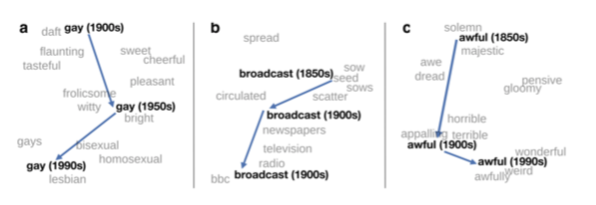

- [[language change]]
  collapsed:: true
	- ((65428629-8dba-4540-9304-5a4bbc5ff43e))
- the history of the English vocabulary
  collapsed:: true
	- the Indo-European language family
	  collapsed:: true
		- 
	- periods
		- [Old English]([[Old English]]): ca. 450–1100
		  collapsed:: true
			- external history
				- {:height 279, :width 593}
				- Germanic conquest
				  collapsed:: true
					- 
				- Viking raids
				  collapsed:: true
					- 
			- linguistic characteristics
			  collapsed:: true
				- {:height 154, :width 597}
		- [Middle English]([[Middle English]]): ca. 1100–1500
		  collapsed:: true
			- external history
			  collapsed:: true
				- {:height 243, :width 512}
			- linguistic characteristics
			  collapsed:: true
				- triglossia
					- high varieties
						- [Latin]([[Latin]])
							- church
							- learning
							- documents
						- [French]([[French]])
							- upper classes
							- feudal aristocracy
					- low variety
						- English
							- peasants
							- lower clergy
							- most people in the city
				- {:height 370, :width 507}
		- [[Early Modern English]]: ca. 1500–1800
		  collapsed:: true
			- external history
			  collapsed:: true
				- {:height 264, :width 545}
			- linguistic characteristics
			  collapsed:: true
				- {:height 221, :width 520}
		- [[Late Modern English]]: ca. 1800–1945 (?)
		  collapsed:: true
			- external history
			  collapsed:: true
				- {:height 219, :width 524}
			- linguistic characteristics
				- {:height 212, :width 527}
		- [[Present-Day English]]: since ca. 1945
		  collapsed:: true
			- external history
				- {:height 139, :width 478}
	- resources
		- [[Bauer2022Introduction]]: ch. 3
		- videos
			- the history of English in 10 minutes
			  collapsed:: true
				- {{video https://www.youtube.com/watch?v=H3r9bOkYW9s}}
			- Martin Hilpert on [[Old English]] and [[Middle English]]
			  collapsed:: true
				- {{video https://www.youtube.com/watch?v=Hdn-gwLgj80}}
- the lexicon of [Present-Day English]([[Present-Day English]])
  collapsed:: true
	- lexical [borrowing]([[borrowing]])
	  collapsed:: true
		- [[Leisi2008Heutige]]: p. 41
		  collapsed:: true
			- > Der heutige englische Wortschatz ist eine einzigartige Mischung von germanischen und romanischen Elementen; in Bezug auf das Vokabular stellt also das Englische einen Sonderfall unter den europäischen Sprachen dar [...].
		- most frequent words
		  collapsed:: true
			- list based on [[COCA]]
				- {:height 478, :width 312}
			- languages of origin
			  collapsed:: true
				- [Scandinavian]([[Norse]])
				  collapsed:: true
					- *they*
					- *their*
					- *to get*
					- *to take*
					- *to give*
					- *like*
					- *to want*
				- [French]([[French]])
				  collapsed:: true
					- *people*
					- *very*
				- [French]([[French]])/[Latin]([[Latin]])
				  collapsed:: true
					- *just*
					- *to use*
		- Germanic “Erbwortschatz”
		  collapsed:: true
			- elements that survived from [OE]([[Old English]]) are basic elements of the vocabulary and make up a large part of any English sentence (very frequent): pronouns, conjunctions, auxiliary verbs etc.
			- fundamental concepts
				- ae. *mann* ‘man’
				- ae. *wīf* ‘wife’
				- ae. *cīld* ‘child’
				- ae. *hūs* ‘house’
				- ae. *drincan* ‘drink’
				- ae. *libban* ‘live’
		- [Latin]([[Latin]]) influence
		  collapsed:: true
			- continental borrowings
				- e.g. *street*, *wine*, *kitchen*, *mile*, *butter*, *cheese*
			- borrowings after settlement of Britain, i.e. after 450
				- e.g. *port*, *mount*, *-chester*
			- borrowings during Christianization
				- e.g. *martyr*, *clerk*, *creed*, *nun*, *verse*
			- later borrowings: part. during Renaissance
		- Old [Norse]([[Norse]]) influence
		  collapsed:: true
			- Viking raids (‘Danelaw’)
			- genetic resemblance between Old Norse and [Old English]([[Old English]])
			- strong influence on basic vocabulary:
				- function words: *they*, *them*, *their*; *though*
				- verbs: *to call*, *to die*, *to take*, *to raise*
				- nouns: *law*, *husband*, *egg*, *birth*
				- adjectives: *awkward*, *ill*, *weak*
			- consequence: English drifts apart from West Germanic languages, e.g. [German]([[German]])
		- [French]([[French]]) superstrate
		  collapsed:: true
			- [[Herbst2010English]]: 316
			  collapsed:: true
				- superstrate influence: situation in which the language of a group of speakers in a socially or politically superior position influences that of the speakers in an inferior position
				- the more prestigious language influences the structure or use of a less prestigious language (dominance of one people)
			- examples
			  collapsed:: true
				- {:height 359, :width 556}
				- {:height 417, :width 558}
		- from other languages
		  collapsed:: true
			- {:height 254, :width 565}
			- load words from around the worlds
			  collapsed:: true
				- 
				  [[Bauer2022Introduction]]: 85
		- recent European loans
		  collapsed:: true
			- 
			  [[Bauer2022Introduction]]: 86
		- dialectal terms
		  collapsed:: true
			- 
			  [[Bauer2022Introduction]]: 86
	- consequences
	  collapsed:: true
		- [dissociation]([[dissociation]])
		  collapsed:: true
			- {:height 326, :width 505}
		- (partial) [synonymy]([[synonymy]])
		  collapsed:: true
			- (subtle) meaning differences; e.g.:
				- [register]([[register]])
				  collapsed:: true
					- *to ask* (c. 885)
					- *to question* (c. 1470)
					- *to interrogate* (c. 1483)
				- [connotation]([[connotation]])
				  collapsed:: true
					- *solitude*
					- *loneliness* (‘Einsamkeit’),
					- *freedom* — *liberty* (‘Freiheit’)
			- → greater linguistic choice due to (partial) synonyms
		- “hard words”
		  collapsed:: true
			- often [etymologically]([[etymology]]) unrelated → hard to learn (e.g. appendix, hippopotamus)
			- people not that familiar with their use often confuse them
			- examples
				- *illiterate* vs *illegitimate*
				- *missile* vs *missive*
				- *epitaph* vs *epithet*
			- confusion labeled ‘malapropism’
- types of lexical change
  collapsed:: true
	- change in usage frequency
		- increases: [[lexical innovation]]
		  collapsed:: true
			- {{embed ((659fd415-cee3-448e-821e-2816f8b8de3c))}}
		- decreases: [[lexical attrition]]
		  collapsed:: true
			- *telephone* in the [[COCA]]
			  id:: 65a6c6dc-4f0d-45d7-b034-7a841987bf3d
				- {:height 261, :width 401}
	- [[meaning change]]
	  collapsed:: true
		- {:height 212, :width 577}
		  [[Hamilton2016Diachronic]]
		- {{embed ((659fd33f-0f0e-4bb0-b600-b34952c8a400))}}
- [[lexical innovation]]
	- the interplay of cultural and linguistic innovation
	  id:: 65a6ae2e-094a-440c-96b5-72db6206a2e4
		- society continually changes as new practices and products emerge (e.g. smartphones)
		- these changes typically first manifest themselves in language on the level of lexis in the form of [[neologisms]]
			- formal neologisms
				- *smartphone*
				- *iPhone*
				- *Covid*
			- semantic neologisms
				- *hotspot*
				- de. *Querdenker*
				- *(social) distancing*
				- *spreader*
		- knowledge of words is [conventional]([[conventionalization]]): speakers learn form-meaning pairings (→ [Model of the Linguistic Sign]([[Model of the Linguistic Sign]]) by Ferdinand de Saussure; e.g. *tree*)
	- [[lexical renaissance]]: innovation after [[lexical attrition]]
		- *dotard*
		- *to furlough*
- [[lexical attrition]]
  collapsed:: true
	- $\approx$ word loss
	- examples
		- {{embed ((65a6c6dc-4f0d-45d7-b034-7a841987bf3d))}}
		- *Walkman* in the [[COHA]]
			- {:height 271, :width 285}
			- *millenium bug*
- [[practice]]: study [[lexical attrition]]
  collapsed:: true
	- get a sample of words that have become obsolete from the [[OED]]
		- collect words using Advanced Search
		  collapsed:: true
			- 
		- export data as `csv`
		  collapsed:: true
			- 
	- analyse in [[Microsoft Excel]] what types of words have become obsolete
		- model sheet: https://1drv.ms/x/s!AvkgNVl9yS6aohjiV_csX3J22GCB
		- create a `Table`
		  collapsed:: true
			- 
		- use a [Pivot Table]([[Microsoft Excel/pivot table]]) to analyse the following variables (columns)
			- word-formation processes
			- language of origin
			- subject areas