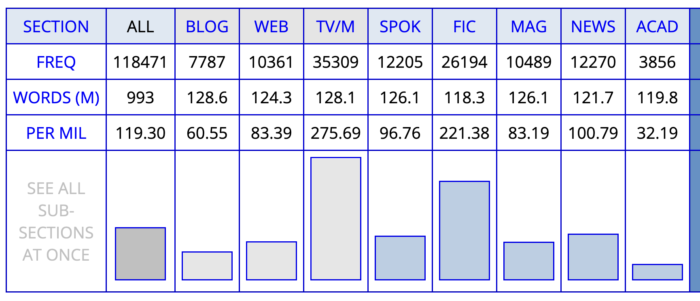

- the interplay of cultural and linguistic innovation
  collapsed:: true
	- {{embed ((65a6ae2e-094a-440c-96b5-72db6206a2e4))}}
- the [[S-curve Model]] of [[lexical innovation]], [[diffusion]], and [[lexical change]]
  collapsed:: true
	- Integration of Milroy’s and Rogers’ model of diffusion stages into an S-curve.
		- 
		  collapsed:: true
		  ([[Kerremans2015Web]]: 65)
- [[EC-Model]] ([[Schmid2015Blueprint]], [[Schmid2020DynamicsLinguistic]])
  collapsed:: true
	- the more frequently a word is used, the more likely it is
		- that speakers have stored it in their [[mental lexicon]] ([[entrenchment]])
		- that it is part of the conventional language system of a language ([[conventionalization]])
	- {{embed ((65b2934b-9476-45cb-8e85-ea8e69d5a5b2))}}
- pathways of [[diffusion]]
  collapsed:: true
	- types of [[linguistic variation]] and diffusion
	  collapsed:: true
		- ((6544372d-a09f-44fd-95e5-eedf29f8e9ab))
	- dimensions of diffusion
	  collapsed:: true
		- across speakers and communities
		- across text types
	- examples for different degrees of diffusion
	  collapsed:: true
		- 
- [[operationalization]]
  collapsed:: true
	- [[frequency]] as an indicator for [[entrenchment]] and [conventionality]([[conventionalization]]) ([[Stefanowitsch2017Corpusbased]])
	  collapsed:: true
		- [[corpus-as-input]]: language used in corpora represents potential [[exposure]] to speakers
		- [[corpus-as-output]]: languaged used by speakers in corpora represents potential degrees of entrenchment
	- [[frequency]] measures (examples from [[Würschinger2021Social]])
		- total frequency
		  collapsed:: true
			- most frequent
			  collapsed:: true
				- 
			- around the median
			  collapsed:: true
				- 
			- least frequent
			  collapsed:: true
				- 
			- case study selection
			  collapsed:: true
				- 
				  id:: d2cf2578-ed9f-4cc0-826e-fcf1255ac7c0
				  collapsed:: true
		- frequency over time ([[diachronic]])
		  collapsed:: true
			- raw frequency
			  collapsed:: true
				- 
			- cumulative frequency
			  collapsed:: true
				- 
		- [diffusion]([[diffusion]]) across communities
		  collapsed:: true
			- 
		- [[diffusion]] across [text types]([[text type]])
		  collapsed:: true
			- *bro* in the [[COCA]]
			  collapsed:: true
				- 
			- *brother* in the [[COCA]]
			  collapsed:: true
				- 
- [[practice]]
	- study lexical innovations in corpora
		- using the case study words from [[Würschinger2021Social]],
			- ((d2cf2578-ed9f-4cc0-826e-fcf1255ac7c0))
		- for each of these words collect data from the [[NOW]] corpus about
			- their total usage frequency (absolute and relative)
			- whether they are increasing or decreasing in frequency/conventionality over time
			- compare the data from the NOW corpus to the results in [[Würschinger2021Social]]
	- ((65553569-77c5-4153-a348-ce7175770b70))