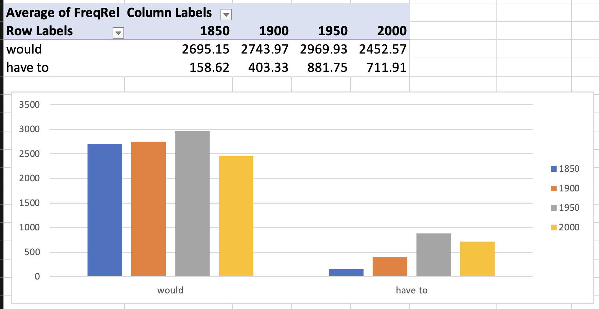
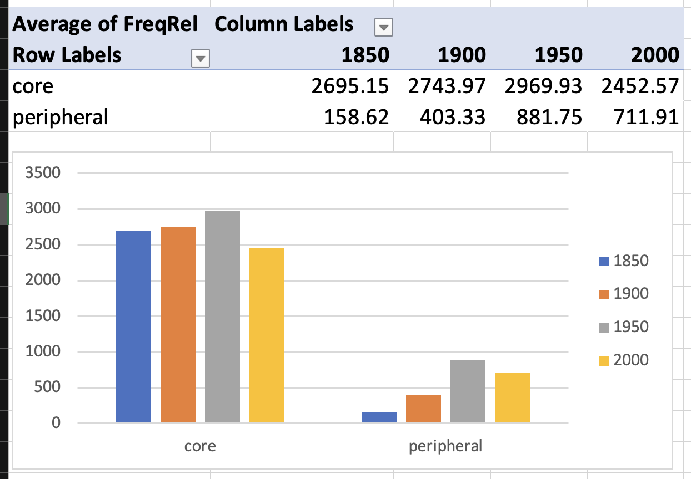
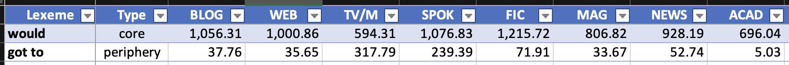
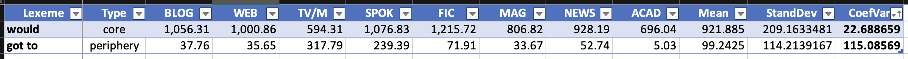

- the importance of variation in lexicology
	- ((65427192-ad8c-47b7-b451-1a6f6544f72b))
- dimensions of variation
	- overview of types of variation
		- diatopic, diastratic, and diaphasic
			- 
			  ([[Kortmann2020English]]: 204)
			- id:: 6544372d-a09f-44fd-95e5-eedf29f8e9ab
		- language change = language variation over time = diachronic
		- variation based on “user” and “language use”
			- ((6542869f-aa64-4e84-81d8-b484008a566a))
			  ([[Lipka1992OutlineEnglish]])
	- speaker variation
		- regional variation
			- dialect
				- ((65428353-1d92-4692-8637-1a5292d2038c))
			- regional variation in word use and [[lexical innovation]]
				- 
				  ([[Grieve2018MappingLexical]])
		- [[sociolect]]
			- ((6542846e-6dc2-411b-b715-cd318df3288b))
	- situational variation
		- register
			- ((65428396-7109-446e-b087-79b3a398b383))
- [[lexical change]] and [[lexical variation]] in English [[modal verbs]] ([[Hilpert2015Grammatical]])
  id:: 65b93235-22ef-49d3-a36d-85d9d5361657
	- theory and previous work
		- ((87e6447a-b496-42b2-b94c-1ab8281ebecc))
		- core and peripheral modals
			- core modals
				- will
				- would
				- can
				- could
				- may
				- might
				- shall
				- should
				- must
			- peripheral modals
				- BE going to
				- have to
				- got to
				- need to
		- modals with changes in frequency over time
			- ((65b931b6-80a0-4645-be43-1709c001b23e))
			- ((40c5c6c1-8a97-4cd0-97f5-dc0d3f32b53b))
			- corpus data
				- {{embed ((65b931cd-72f0-4e06-a004-9b663dfe3f77))}}
			- core & decreasing ([source](((386ec37c-3634-4c15-b5f2-9dc4b4800c0c))))
			  id:: 65b93338-375e-4203-a338-3451e0c793f8
				- would
				- may
				- should
				- must
				- shall
			- peripheral & increasing ([source](((f10ad767-e2a5-45c6-b405-985dd2a6fa04))))
			  id:: 14876ed2-5361-4901-b68d-8cb7f9b1d174
				- BE going to
				- have to
				- got to
				- need to
		- interaction between frequency changes and causes
			- ((0c4f8040-5cb3-45eb-b5c7-04096cae8cf3))
		- potential cause: [[lexical variation]] with regard to [text types]([[text type]])
			- ((735f231c-9205-408e-8d58-9e4502015c6b))
	- [[practice]]
		- collaborative [[Microsoft Excel]] spreadsheet: https://1drv.ms/x/s!AvkgNVl9yS6aoi84ilIjaZZQfHzZ
		- study the rise and fall of modal verbs in the [[COHA]]
			- use queries to search for the following modal verbs
				- ((65b93338-375e-4203-a338-3451e0c793f8))
					- *would*
						- `would *_vv`
					- *may*
						- `may *_vv`
					- *should*
						- `should *_vv`
					- *must*
						- `must *_vv`
					- *shall*
						- `shall *_vv`
				- ((14876ed2-5361-4901-b68d-8cb7f9b1d174))
					- be going to
						- `BE going to *_vv`
					- have to
						- `HAVE to *_vv`
					- got to
						- `got to *_vv`
					- need to
						- `NEED to *_vv`
			- determine their absolute and relative [frequencies]([[frequency]]) [over time]([[diachronic]])
				- in these time intervals
					- 1850
					- 1900
					- 1950
					- 2000
				- screenshot
					- 
			- investigate changes in [[frequency]] [over time]([[diachronic]]) by using [pivot tables]([[Microsoft Excel/pivot table]]) and [bar charts]([[bar chart]])
				- investigate whether these individual words show frequency changes over time
					- 
				- investigate whether the groups of [core](((65b93338-375e-4203-a338-3451e0c793f8))) and [peripheral](((14876ed2-5361-4901-b68d-8cb7f9b1d174))) modal verbs show frequency changes on aggregate
					- 
		- investigate whether these modals show preferences for specific text types using the [[COCA]]
			- gather text type data
				- 
			- determine text type specificity based on the [[Coefficient of Variation]] (CV)
				- background
					- **Definition**: The coefficient of variation (CV) is a statistical measure that describes the relative variability of data. It is calculated as the ratio of the [standard deviation]([[standard deviation]]) to the mean, and is often expressed as a percentage. This measure is particularly useful when comparing the degree of variation from one data series to another, even if the means are drastically different from each other.
					- **Application**: In the context of corpus linguistics, the CV can be used to measure the variability of word frequencies across different texts or corpora.
					- **Mathematical Formula**
						- CV = (Standard Deviation / Mean)
						- $$ CV = \left( \frac{\sigma}{\mu} \right) $$
					- **Calculation in Excel**
						- **Calculate the Mean**: Use the `AVERAGE` function in Excel to calculate the mean of your data. If your data is in cells A1 to A10, you would type `=AVERAGE(A1:A10)` in a new cell.
						  logseq.order-list-type:: number
						- **Calculate the Standard Deviation**: Use the `STDEV.S` function to calculate the standard deviation. If your data is in cells A1 to A10, you would type `=STDEV.S(A1:A10)` in a new cell.
						  logseq.order-list-type:: number
						- **Calculate the Coefficient of Variation**: Divide the standard deviation by the mean and multiply by 100 to get the coefficient of variation. If your mean is in cell B1 and your standard deviation is in cell B2, you would type `=(B2/B1)*100` in a new cell.
						  logseq.order-list-type:: number
				- differences between individual modal verbs
					- 
					- 
					  id:: 64b64be4-e5a6-4ddf-9483-3cc5b0e458f5
				- differences between the two groups of core and peripheral modal verbs
					- 
			-