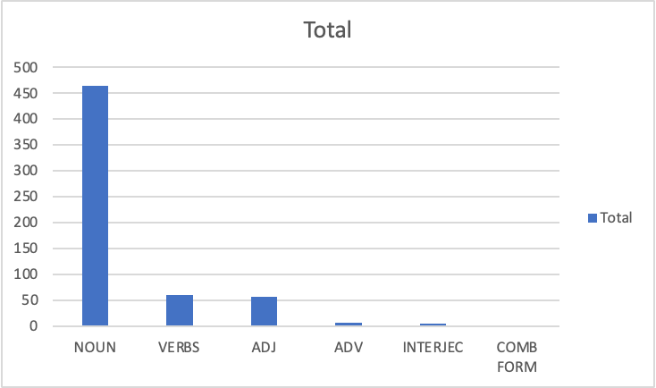
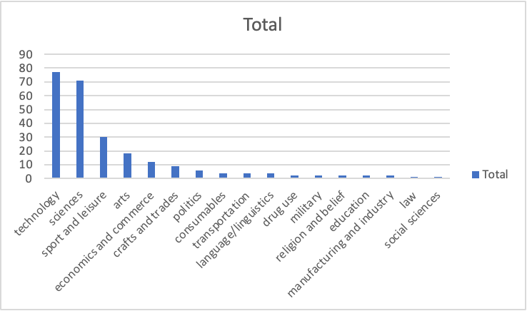
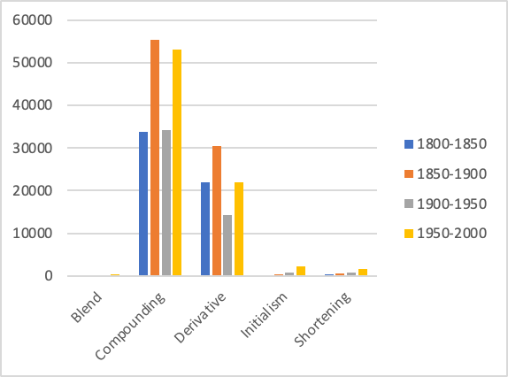
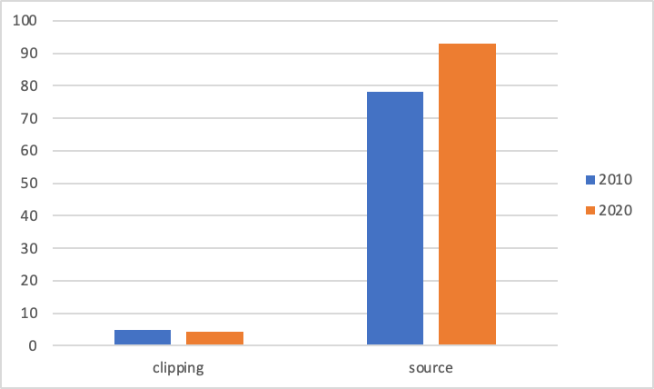
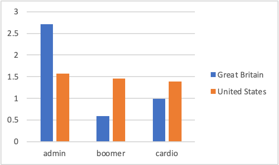
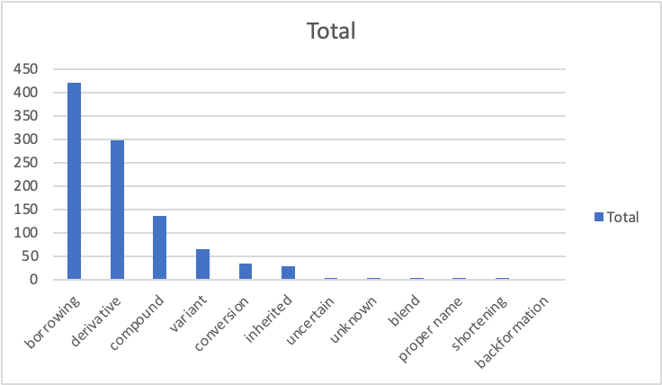
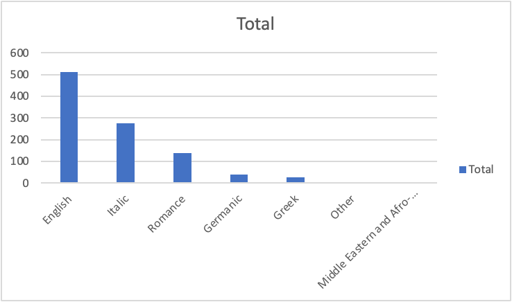
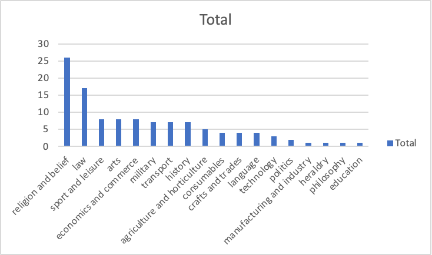

- lexical variation
	- {{embed ((65b93235-22ef-49d3-a36d-85d9d5361657))}}
- organisational information
	- requirements
		- {{embed ((65425e64-f62b-45e4-9da9-8b26bc31840f))}}
	- term papers
		- ((a7d2bef0-8a26-46ee-bda9-eac7865b9f45))
		- structure
			- {{embed ((659fd122-b661-47ec-829d-bdb17e203771))}}
		- consulting
			- {{embed [[term paper/consulting]]}}
		- ideas
			- algospeak
				- e.g. *unalive*, *seggs*
- recap
	- model of the linguistic sign
		- {{embed ((6544372d-50ea-40d7-8082-30e0057fd539))}}
	- defining words
		- {{embed ((65491fa2-a93b-4887-9a1a-434e27a5991e))}}
		- {{embed ((6544372d-65f1-4ae5-ae13-4ae412241703))}}
	- defining dictionaries
		- {{embed ((654a5d4c-eff8-4a6a-affd-a9bfbbfdeec2))}}
	- dictionaries for studying words
		- [[Urban Dictionary]]
			- ((65553a8d-b9eb-4573-b785-83bc7df6c18e))
		- [[Wiktionary]]
			- ((65553b8c-d0ac-457e-ac10-ae8d639c476a))
		- [[OED]]
			- ((654c03d9-6de6-4f2e-a4cf-02d8b723d187))
			- ((655541e7-f6ff-466a-9eca-50eb8a688807))
	- studying recent lexical innovation in the [[OED]] ([source](((6555fbbb-8a5e-48f2-9250-072707d17a95))))
		- [[word-formation]]
			- 
		- [[word classes]]
			- 
		- subjects
			- 
	- historical productivity of word-formation processes over time ([source](((655fe460-f73c-466f-8bd5-9b79551c3ddc))))
		- 
	- the role of semantic domains: the case of shortenings
		- ((6569a945-6eab-4695-97a2-b12c9dc68db1))
	- studying clippings ([source](  ))
		- frequency
			- over time
				- 
			- source vs clipped forms
				- 
			- geographical distribution
				- 
		- meaning (differences)
			- between source and clipped forms
				- ((657b1a01-7545-42a5-818d-812929bcd02a))
				- for advanced collocational anaysis: try [[Sketch Engine]] (→ Word Sketches)
			- between text types
				- ((658461e0-86b0-4bc0-b412-4b44bfde8c4d))
	- lexical attrition ([source](((65a69cab-98de-495c-b5f1-6f41eafd378b))))
		- word-formation processes
			- 
		- origin languages
			- 
		- subjects
			- 
- feedback and anything else?