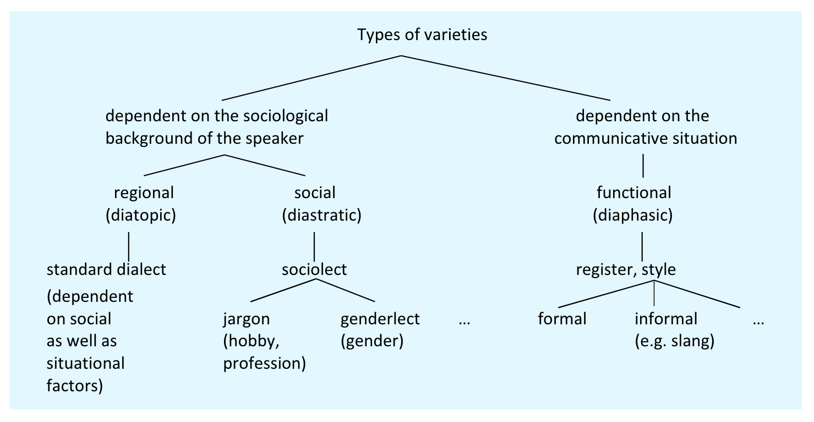

- the importance of variation in lexicology
  collapsed:: true
	- ((65427192-ad8c-47b7-b451-1a6f6544f72b))
- dimensions of variation
	- overview of types of variation
		- diatopic, diastratic, and diaphasic
		  collapsed:: true
			- 
			  ([[Kortmann2020English]]: 204)
			- id:: 6544372d-a09f-44fd-95e5-eedf29f8e9ab
		- variation based on “user” and “language use”
		  collapsed:: true
			- ((6542869f-aa64-4e84-81d8-b484008a566a))
			  ([[Lipka1992OutlineEnglish]])
	- speaker groups
		- regional variation
			- dialect
			  collapsed:: true
				- ((65428353-1d92-4692-8637-1a5292d2038c))
			- regional variation in word use and [[lexical innovation]]
			  collapsed:: true
				- 
				  ([[Grieve2018MappingLexical]])
		- [[sociolect]]
		  collapsed:: true
			- ((6542846e-6dc2-411b-b715-cd318df3288b))
	- situational variation
		- register
		  collapsed:: true
			- ((65428396-7109-446e-b087-79b3a398b383))