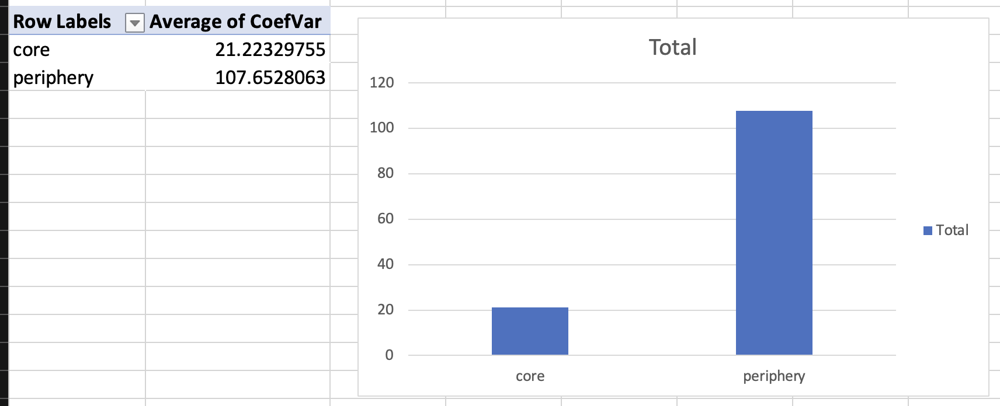

- the importance of variation in lexicology
  collapsed:: true
	- ((65427192-ad8c-47b7-b451-1a6f6544f72b))
- dimensions of variation
  collapsed:: true
	- overview of types of variation
	  collapsed:: true
		- diatopic, diastratic, and diaphasic
		  collapsed:: true
			- 
			  ([[Kortmann2020English]]: 204)
			- id:: 6544372d-a09f-44fd-95e5-eedf29f8e9ab
		- language change = language variation over time = diachronic
		- variation based on “user” and “language use”
		  collapsed:: true
			- ((6542869f-aa64-4e84-81d8-b484008a566a))
			  ([[Lipka1992OutlineEnglish]])
	- speaker variation
	  collapsed:: true
		- regional variation
		  collapsed:: true
			- dialect
			  collapsed:: true
				- ((65428353-1d92-4692-8637-1a5292d2038c))
			- regional variation in word use and [[lexical innovation]]
			  collapsed:: true
				- 
				  ([[Grieve2018MappingLexical]])
		- [[sociolect]]
		  collapsed:: true
			- ((6542846e-6dc2-411b-b715-cd318df3288b))
	- situational variation
	  collapsed:: true
		- register
		  collapsed:: true
			- ((65428396-7109-446e-b087-79b3a398b383))
- [[lexical change]] and [[lexical variation]] in English [[modal verbs]] ([[Hilpert2015Grammatical]])
	- theory and previous work
	  collapsed:: true
		- ((87e6447a-b496-42b2-b94c-1ab8281ebecc))
		- core and peripheral modals
			- core modals
			  collapsed:: true
				- will
				- would
				- can
				- could
				- may
				- might
				- shall
				- should
				- must
			- peripheral modals
			  collapsed:: true
				- BE going to
				- have to
				- got to
				- need to
		- modals with changes in frequency over time
			- ((65b931b6-80a0-4645-be43-1709c001b23e))
			- ((40c5c6c1-8a97-4cd0-97f5-dc0d3f32b53b))
			- corpus data
			  collapsed:: true
				- {{embed ((65b931cd-72f0-4e06-a004-9b663dfe3f77))}}
			- core & decreasing ([source](((386ec37c-3634-4c15-b5f2-9dc4b4800c0c))))
			  id:: 65b93338-375e-4203-a338-3451e0c793f8
			  collapsed:: true
				- would
				- may
				- should
				- must
				- shall
			- peripheral & increasing ([source](((f10ad767-e2a5-45c6-b405-985dd2a6fa04))))
			  id:: 14876ed2-5361-4901-b68d-8cb7f9b1d174
			  collapsed:: true
				- BE going to
				- have to
				- got to
				- need to
		- interaction between frequency changes and causes
		  collapsed:: true
			- ((0c4f8040-5cb3-45eb-b5c7-04096cae8cf3))
		- potential cause: [[lexical variation]] with regard to [text types]([[text type]])
		  collapsed:: true
			- ((735f231c-9205-408e-8d58-9e4502015c6b))
	- [[practice]]
		- collaborative [[Microsoft Excel]] spreadsheet: https://1drv.ms/x/s!AvkgNVl9yS6aoi84ilIjaZZQfHzZ
		- study the rise and fall of modal verbs in the [[COHA]]
			- use queries to search for the following modal verbs
			  collapsed:: true
				- ((65b93338-375e-4203-a338-3451e0c793f8))
					- *would*
					  collapsed:: true
						- `would *_vv`
					- *may*
					  collapsed:: true
						- `may *_vv`
					- *should*
					  collapsed:: true
						- `should *_vv`
					- *must*
					  collapsed:: true
						- `must *_vv`
					- *shall*
					  collapsed:: true
						- `shall *_vv`
				- ((14876ed2-5361-4901-b68d-8cb7f9b1d174))
					- be going to
					  collapsed:: true
						- `BE going to *_vv`
					- have to
					  collapsed:: true
						- `HAVE to *_vv`
					- got to
					  collapsed:: true
						- `got to *_vv`
					- need to
					  collapsed:: true
						- `NEED to *_vv`
			- determine their absolute and relative [frequencies]([[frequency]]) [over time]([[diachronic]])
			  collapsed:: true
				- in the decades
				  collapsed:: true
					- 1850
					- 1900
					- 1950
					- 2000
				- screenshot
				  collapsed:: true
					- 
			- investigate changes in [[frequency]] [over time]([[diachronic]]) by using [pivot tables]([[Microsoft Excel/pivot table]]) and [bar charts]([[bar chart]])
			  collapsed:: true
				- investigate whether these individual words show frequency changes over time
				  collapsed:: true
					- 
				- investigate whether the groups of [core](((65b93338-375e-4203-a338-3451e0c793f8))) and [peripheral](((14876ed2-5361-4901-b68d-8cb7f9b1d174))) modal verbs show frequency changes on aggregate
				  collapsed:: true
					- 
		- investigate whether these modals show preferences for specific text types using the [[COCA]]
			- gather text type data
			  collapsed:: true
				- 
			- determine text type specificity based on the [[Coefficient of Variation]] (CV)
			  collapsed:: true
				- background
				  collapsed:: true
					- **Definition**: The coefficient of variation (CV) is a statistical measure that describes the relative variability of data. It is calculated as the ratio of the standard deviation to the mean, and is often expressed as a percentage. This measure is particularly useful when comparing the degree of variation from one data series to another, even if the means are drastically different from each other.
					- **Application**: In the context of corpus linguistics, the CV can be used to measure the variability of word frequencies across different texts or corpora.
					- **Mathematical Formula**
					  collapsed:: true
						- CV = (Standard Deviation / Mean)
						- $$ CV = \left( \frac{\sigma}{\mu} \right) $$
					- **Calculation in Excel**
					  collapsed:: true
						- **Calculate the Mean**: Use the `AVERAGE` function in Excel to calculate the mean of your data. If your data is in cells A1 to A10, you would type `=AVERAGE(A1:A10)` in a new cell.
						  logseq.order-list-type:: number
						- **Calculate the Standard Deviation**: Use the `STDEV.S` function to calculate the standard deviation. If your data is in cells A1 to A10, you would type `=STDEV.S(A1:A10)` in a new cell.
						  logseq.order-list-type:: number
						- **Calculate the Coefficient of Variation**: Divide the standard deviation by the mean and multiply by 100 to get the coefficient of variation. If your mean is in cell B1 and your standard deviation is in cell B2, you would type `=(B2/B1)*100` in a new cell.
						  logseq.order-list-type:: number
				- differences between individual modal verbs
					- 
					  id:: 64b64be4-e5a6-4ddf-9483-3cc5b0e458f5
				- differences between the two groups of core and peripheral modal verbs
					- 
			-