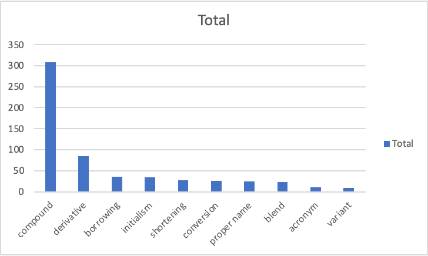
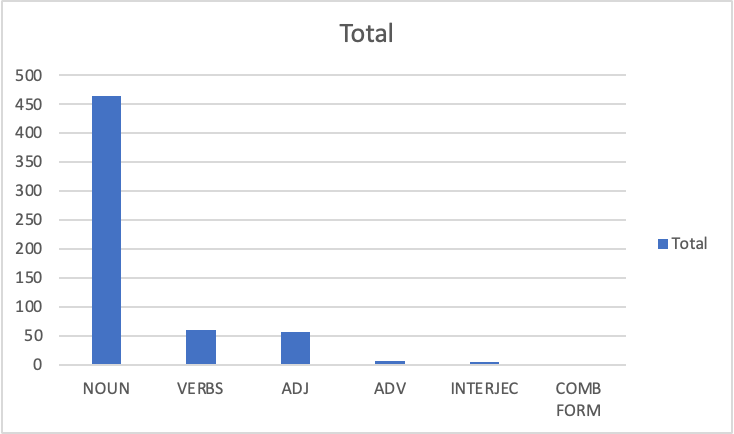
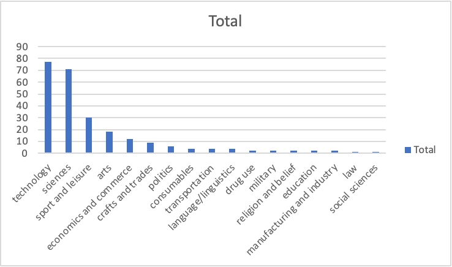
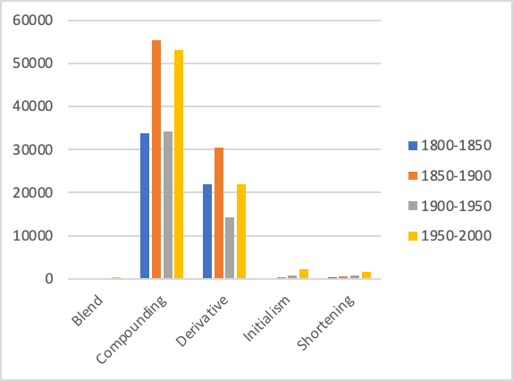
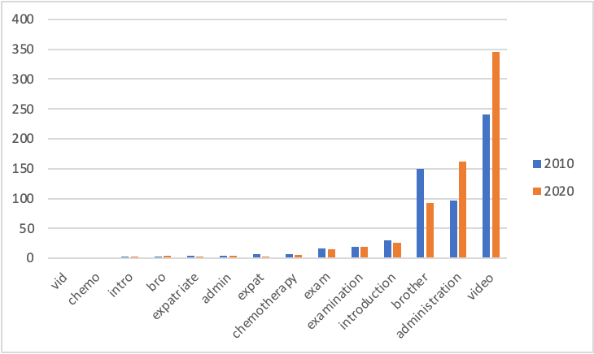
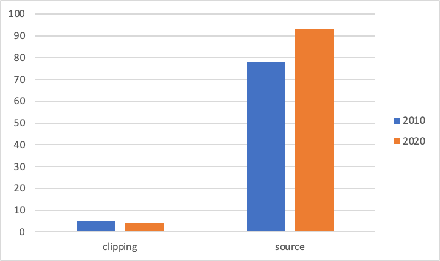
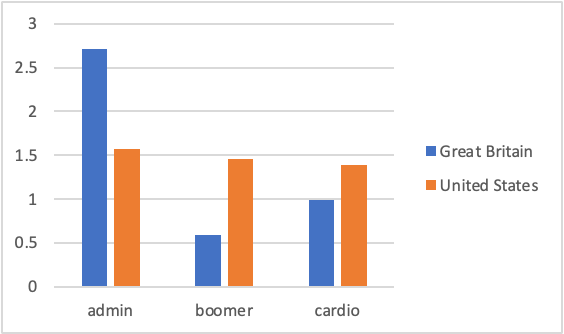
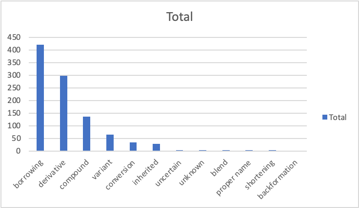
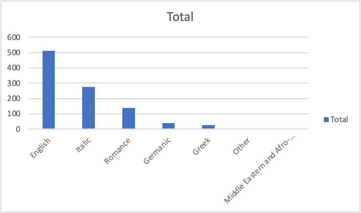
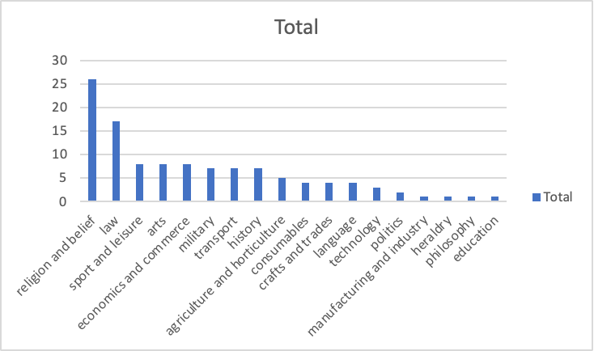

- lexical variation
	- {{embed ((65b93235-22ef-49d3-a36d-85d9d5361657))}}
- wrap-up
	- organisational information
		- requirements
		  collapsed:: true
			- {{embed [[requirements]]}}
		- term papers
			- structure
			  collapsed:: true
				- {{embed ((659fd122-b661-47ec-829d-bdb17e203771))}}
			- consulting
			  collapsed:: true
				- {{embed [[term paper/consulting]]}}
	- recap
		- model of the linguistic sign
		  collapsed:: true
			- {{embed ((6544372d-50ea-40d7-8082-30e0057fd539))}}
		- defining words
		  collapsed:: true
			- {{embed ((65491fa2-a93b-4887-9a1a-434e27a5991e))}}
			- {{embed ((6544372d-65f1-4ae5-ae13-4ae412241703))}}
		- defining dictionaries
		  collapsed:: true
			- {{embed ((654a5d4c-eff8-4a6a-affd-a9bfbbfdeec2))}}
		- dictionaries for studying words
		  collapsed:: true
			- [[Urban Dictionary]]
			  collapsed:: true
				- ((65553a8d-b9eb-4573-b785-83bc7df6c18e))
			- [[Wiktionary]]
			  collapsed:: true
				- ((65553b8c-d0ac-457e-ac10-ae8d639c476a))
			- [[OED]]
				- ((654c03d9-6de6-4f2e-a4cf-02d8b723d187))
				- ((655541e7-f6ff-466a-9eca-50eb8a688807))
		- studying recent lexical innovation in the [[OED]] ([source](((6555fbbb-8a5e-48f2-9250-072707d17a95))))
		  collapsed:: true
			- [[word-formation]]
				- 
			- [[word classes]]
				- 
			- subjects
				- 
		- historical productivity of word-formation processes over time ([source](((655fe460-f73c-466f-8bd5-9b79551c3ddc))))
		  collapsed:: true
			- 
		- the role of semantic domains: the case of shortenings
		  collapsed:: true
			- ((6569a945-6eab-4695-97a2-b12c9dc68db1))
		- studying clippings ([source](  ))
		  collapsed:: true
			- frequency
			  collapsed:: true
				- over time
					- 
				- source vs clipped forms
					- 
				- geographical distribution
					- 
			- meaning (differences)
				- between source and clipped forms
					- ((657b1a01-7545-42a5-818d-812929bcd02a))
				- between text types
					- ((658461e0-86b0-4bc0-b412-4b44bfde8c4d))
		- lexical attrition ([source](((65a69cab-98de-495c-b5f1-6f41eafd378b))))
		  collapsed:: true
			- word-formation processes
			  collapsed:: true
				- 
			- origin languages
			  collapsed:: true
				- 
			- subjects
			  collapsed:: true
				- 
	- feedback and anything else?