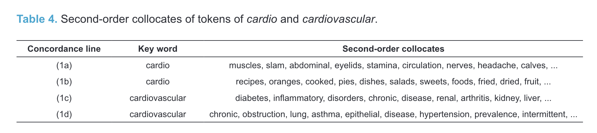

tags:: [[paper]]

- [[bibliography]]
	- Hilpert, Martin, David Correia Saavedra, and Jennifer Rains. 2023. ‘Meaning Differences between English Clippings and Their Source Words: A Corpus-Based Study’. *ICAME Journal* 47 (1): 19–37. [https://doi.org/10.2478/icame-2023-0002](https://doi.org/10.2478/icame-2023-0002).
	  id:: 645a1add-5577-41b5-a719-4379a3fc72d5
- [[abstract]]
  id:: 645a1b9e-f78b-46c6-a43e-262f285a67d2
  collapsed:: true
	-
	- > This paper uses corpus data and methods of [[distributional semantics]] in order to study English [clippings]([[clipping]]) such as dorm (< dormitory), memo (< memorandum), or quake (< earthquake).
	- id:: 646c7ffd-bf32-4ce5-9756-917cc35793c1
	  > We investigate whether systematic [meaning differences]([[semantic/variation]]) between clippings and their source words can be detected.
	- > The analysis is based on a sample of 50 English clippings.
	- id:: 646c7ffd-64bb-4d36-b9eb-e4f2494ab615
	  > Each of the clippings is represented by a [concordance]([[concordance]]) of 100 examples in context that were gathered from the [Corpus of Contemporary American English]([[COCA]]).
	- id:: 646c7ffd-caf2-4a96-b8e4-16eedf3cecfd
	  > We compare clippings and their source words both at the aggregate level and in terms of comparisons between individual clippings and their source words.
	- id:: 646c7ffd-bfe5-4944-b360-056be5d512c8
	  > The data show that clippings tend to be used [in contexts]([[text type/variation]]) that represent involved text production, which aligns with the idea that clipped words signal familiarity with their referents.
	- id:: 646c7ffd-f579-4778-a862-f26364baf6ec
	  > It is further observed that individual clippings and their source words partly diverge in their distributional profiles, reflecting both overlap and differences with regard to their meanings.
	- > We interpret these findings against the theoretical background of [Construction Grammar]([[Construction Grammar]]) and specifically the Principle of No Synonymy.
- [[research questions]]
  id:: 6571ffc8-8203-476c-b186-12b045460a4e
  collapsed:: true
	- > “This paper uses corpus data in order to study English clippings such as dorm (< dormitory), memo (< memorandum), or quake (< earthquake), which are formed on the basis of existing lexical items from which phonological material is deleted. More specifically, we investigate meaning differences between clippings and their source words. Are there semantic or pragmatic differences between pairs such as dorm and dormitory, and if so, what are they? Is it possible to formulate generalizations that capture how clippings and their source words relate to one another with regard to meaning? How should these relations be described?” (Hilpert et al., 2023, p. 19)
- [[data]]
  id:: 645a1d76-e12f-450a-86b2-e69ccea0890f
	- id:: 646c7ffd-9ec6-4e8d-a179-d516891af48f
	  > “Our study focuses on a set of 50 English [clippings]([[clipping]]) and their corresponding source words.
		- 
		  id:: 645a2870-9ab6-4a81-941d-44fe6a3c121a
	- id:: 645a2859-a8d9-42e6-a102-69fd03ed164e
	  > For each clipping and each source word, we retrieve corpus data from the [Corpus of Contemporary American English]([[COCA]]) (Davies 2008), which serves as the basis for our analyses.” (Hilpert et al., 2023, p. 19)
- [[text type/variation]]: involved vs information text production ([[Biber1988Variation]])
	- id:: 645a1dbd-328b-464e-b703-0ef2c6ab114f
	  > “Clippings appear to be preferred in contexts in which there is substantial common ground between speaker and hearer, which aligns with the notion that clippings signal familiarity with the ideas that are conveyed (Wierzbicka 1984; Quirk et al. 1985; Plag 2003; Katamba 2005).” (Hilpert et al., 2023, p. 20)
- [[method]]
	- [[collocations]]
	- [[word embeddings]]
- [meaning]([[meaning]]) of [clippings]([[clipping]])
  id:: 6571ffc8-c600-478a-a693-b6438612d82c
  collapsed:: true
	- id:: 645a1fda-7e5f-4fa4-8572-25f32477431e
	  > “At one extreme of the continuum, the semantic distance between the two is thought to be minimal, or even non-existent. For example, Dressler (2000: 4) argues that abbreviations and clippings such as GOP (< Grand Old Party) or mic (< microphone) do not, as a matter of principle, change the meaning of their source words. Clippings and their source words are thus viewed as mutual alternatives that only differ in form.” (Hilpert et al., 2023, p. 20)
	- the author’s framework
		- id:: 645a1ffc-fe23-483c-bb95-d1e5ca0548e3
		  > “The present paper adopts a view of clippings and their meanings that owes its general orientation to what Goldberg (1995: 67) has termed the [Principle of No Synonymy]([[Principle of No Synonymy]]). That principle holds that a difference in linguistic form will always indicate a difference in meaning, either with regard to semantic aspects or concerning discourse-functional characteristics of the form in question. We thus work with a broad notion of meaning that includes information-structural, discourse-functional and interpersonal aspects, among other facets of linguistic meaning and function” (Hilpert et al., 2023, p. 21)
		- id:: 645a2047-f5a9-4026-93bd-036c4a482c66
		  > “A prediction that follows from the Principle of No Synonymy is that in authentic language use, clippings and their source words should have distinct distributional characteristics that reflect their functional differences. In line with [usage-based theories of language]([[usage-based approach]]) (Bybee 2010), we adopt the position that language use shapes and reflects speakers’ knowledge of language.”
		- id:: 645a20e9-f7b0-478b-bd31-d1fa07fdd451
		  > “We further subscribe to what is known as the [distributional hypothesis]([[distributional hypothesis]]) (Firth 1957; Turney and Pantel 2010), which holds that the meaning of words is reflected in their contextual elements in language use. Words that appear in similar contexts can be shown to share aspects of their meanings. For example, the words 2” (Hilpert et al., 2023, p. 21)
			- id:: 645a20d0-6b75-486f-9ba9-bbdf716dc685
			  > “For example, the words cardiovascular and hypertension, which are semantically related, appear in contexts that share many common collocates such as heart, disease, diabetes, stroke, and others.” (Hilpert et al., 2023, p. 22)
		- id:: 645a2087-0c80-4a30-838d-52a0d2c3e8fa
		  > “In this paper, we use corpus data from the COCA (Davies 2008) to compare clippings and their source words, as for example cardio and cardiovascular, in terms of their distributional behavior. We present evidence in order to suggest that there are tangible differences between clippings and their source words, and that despite a fair amount of semantic overlap, it is reasonable to maintain that once a clipping has established itself in language use, speakers will treat it as a separate lexical element.” (Hilpert et al., 2023, p. 22)
- [[text type]] features
  id:: 645a2a9e-c7a6-4959-801f-dea28d63998f
	- 
	  id:: 646c7ffd-a38c-4a5b-8f4f-174115b0de8d
	- p. 25
- differences in [[collocations]] for *cardio-vascular* vs *cardio*
  id:: 645a2b02-c578-4edc-b121-f5bca5a76389
	- {:height 68, :width 268}
		- p. 31