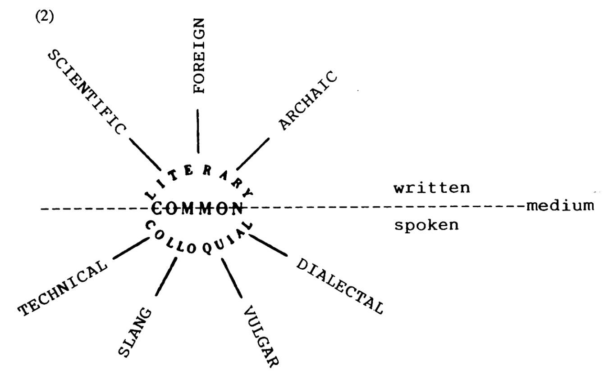
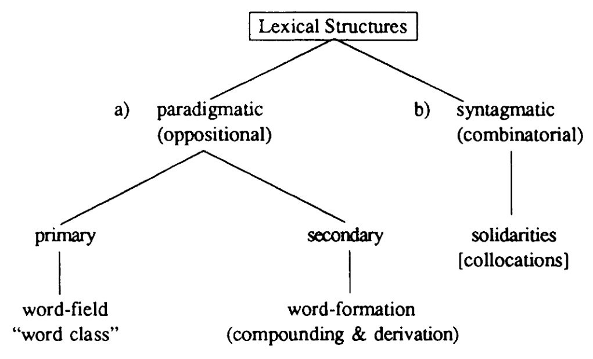
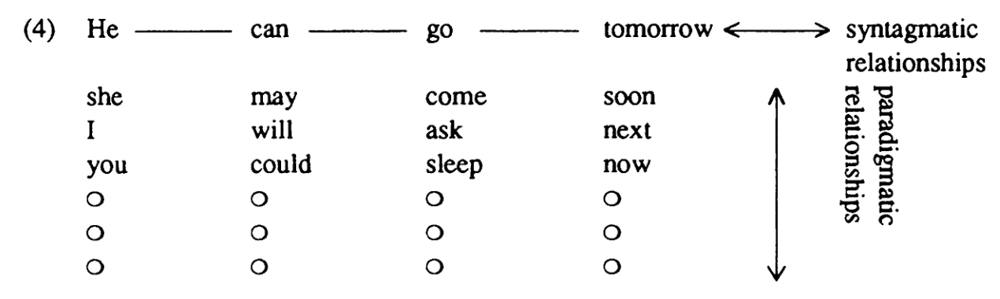
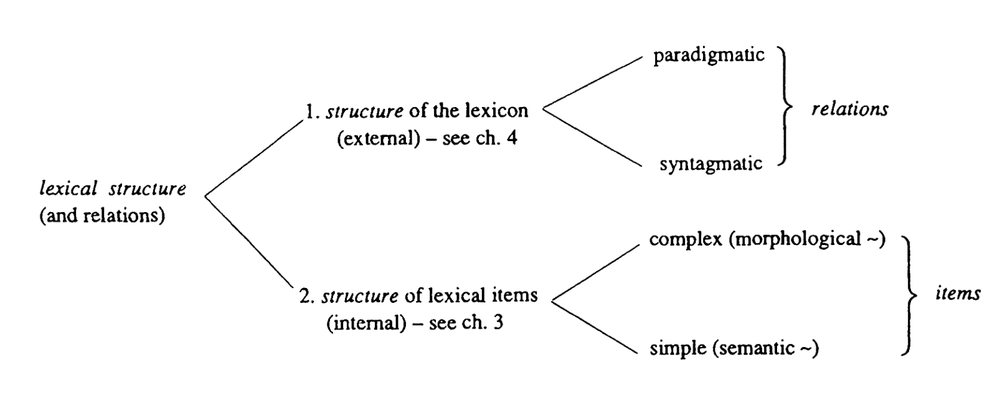
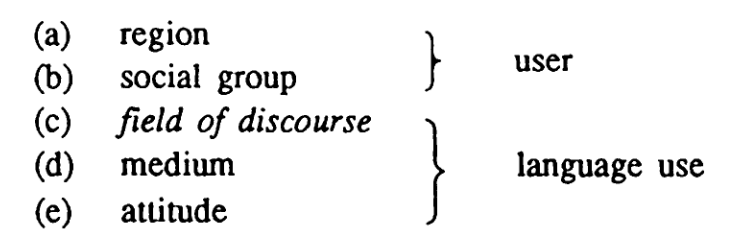

type:: [[book]]

- [[bibliography]]
	- Lipka, Leonhard. 1992. *An Outline of English Lexicology*. Forschung Und Studium Anglistik. Tübingen: Niemeyer.
- questions
	- What’s the structure of the lexicon?
	- What’s the role of lexicology in language?
- notes
	- Chapter I. GENERAL PROBLEMS. Words, Words, Words
		- [[definition]] of [[lexicology]]
			- “What is most important, however, is that in lexicology the stock of words or lexical items is not simply regarded as a list of isolated elements. Lexicologists try to find out generalizations and regularities and especially consider relations between elements (see chapters n and IV). Lexicology is therefore concerned with structures, not with a mere agglomeration of words (cf. Jackson 1988: 222).” (Lipka, 1992, p. 1)
			  id:: 65426e70-9163-44c7-845e-f8620bba56a7
		- [[lexical variation/regional]]
			- “For the LDCE jail is the normal variant, and the British English (BrE) gaol is the marked option. For the COD the American variant is the marked one, and further distinctions are drawn concerning official and literary use.” (Lipka, 1992, p. 2)
		- [[word-formation/conversion]]
			- “But we may also say that jailv and jail2 are derivationally connected and that jail2 is a denominal verb derived from the noun jaily We are then concerned with word-formation processes (see 3.2.). This could be justified by pointing out that the meaning of the verb necessarily contains the meaning of the noun, and that the latter is included in the paraphrase 'to put in jail\ Since the derivation is not formally expressed by a suffix, it is customary to speak in such cases of zero-derivation (see 3.2.2.). That this specific pattern is a productive word-formative process can be seen from examples such as to bag, to bottle, to box, to dock, and to kennel” (Lipka, 1992, p. 8)
		- [[lexical variation]]
			- “However, it should be stressed here that lexical variation and the restriction of items to specific varieties must not be neglected in lexicology, as has so often been the case in the past.” (Lipka, 1992, p. 9)
			  id:: 65427192-ad8c-47b7-b451-1a6f6544f72b
		- [[lexicon]]
			- “In what sense can we say that the 'lexicon' of English is structured, or has structure! What does lexicon mean in the technical sense in which it is used here? Why do we not simply speak of the vocabulary of English? What does one understand by lexical structure!” (Lipka, 1992, p. 10)
				- [[paradigmatic relations]]
				- [[syntagmatic relations]]
				- [[word-formation]]
			- [[definition]]
				- “In the following, I will use lexicon in two senses that are not always sharply distinguished: a) for a metalinguistic level, or a subcomponent in a linguistic model (basically compatible with a variety of theories of language); and b) in the sense of vocabulary as seen from a systematic, synchronic point of view.” (Lipka, 1992, p. 11)
				  id:: 65427395-0bec-45e5-96df-acc2a33e536d
		- the role of [[lexicology]] in language
			- 
			  id:: 6542743b-f510-4190-a295-fe54436f31d7
		- the influence of [[lexical change]] on [[English]]
			- “According to Leisi, contemporary English is a unique mixture of Germanic and Romance elements and this mixing has resulted in the international character of the vocabulary. Its great richness allows far finer differentiation in comparison with other languages. For example German Tier corresponds to either animal or beast in English. Wagen can be rendered by a series of English translations, such as car, cart, carriage, and chariot. As equivalents of nachdenken or iiberlegen, English has think, reflect, meditate, ponder, and cogitate.” (Lipka, 1992, p. 13)
			- “A brief look at the various historical strata may perhaps not be out of place.
				- Through cultural contact with the Romans, partly already on the Continent, and also through the influence of Christianity, a very early stratum of [Latin]([[Latin]])-[Greek]([[Greek]]) words entered the language. This origin is no longer felt by the normal speaker today in words such as dish, cheese, mint, pound, devil. The same holds for some Scandinavian words from about the loth century that today belong to the central core of the vocabulary. This means that their frequency is very high. The stratum contains: they, them, their, sky, skin, skill, ill, die, cast, and take. They partly supersede a number of Old English words such as heofon 'sky, heaven', steorfan 'die', and niman 'take'.” (Lipka, 1992, p. 14)
				- “A more radical change and profound influence on the English vocabulary occurred in the wake of the Norman conquest of 1066. Until the 15th century a great number of [French]([[French]]) words were adopted that belonged especially to the areas of court, state, law, and church (another possible generalization) such as: sovereign, country, minister, parliament, noble, honour, justice, religion, service, virtue, vice, pity, beauty and also preach, arch, and chaste. The influx was strongest before 1400 but continued up to the 17th century.” (Lipka, 1992, p. 15)
			- [[lexical variation]]
				- 
			- [lexical]([[lexicon]]) structures
				- 
				  id:: 65427d85-d8e7-4b95-abca-f699ed24078a
				- [[paradigmatic relations]]
					- [[definition]]
						- “Paradigmatic structures comprise words which can be substituted for each other in a specific slot in a sentence. They necessarily belong to the same syntactic class (see 4.2.)” (Lipka, 1992, p. 17)
						  id:: 65427dd9-4e94-4566-8a9e-f22e81fd2bbb
				- [[syntagmatic relations]]
					- [[definition]]
						- “Syntagmatic structures, which Coseriu labels 'solidarities' ("Solidaritäten"), comprise the relationships between words which are systematically and conventionally combined in a sentence (see 4.3.). Examples for the latter are blond and hair or bark and dog” (Lipka, 1992, p. 17)
						  id:: 65427e11-e2cd-44a3-9ef7-4dcd76a05a6b
						- “Successive linguistic elements that are combined were called "syntagme" by Saussure. In English, both syntagma and sometimes syntagm are used as equivalent terms.” (Lipka, 1992, p. 18)
				- [[paradigmatic relations]]
					- [[definition]]
						- “Elements that are in opposition or contrast in the same position in a syntagma are said to be in a paradigmatic relationship. One can also say that they can be substituted for each other and form a paradigm.” (Lipka, 1992, p. 18)
						  id:: 65427ed2-14e4-4f54-a1e1-ee1e686eeb6a
				- [[syntagmatic relations]] vs [[paradigmatic relations]]
					- 
					  id:: 65427ef4-81da-4ce9-a846-03de8a1505e3
				- structure of [[lexicology]]
					- {:height 1567, :width 629}
					  id:: 65427fa0-1844-4a45-8f57-245483e032ff
				- the importance of [[lexical variation]]
					- “We now come to varieties of English and their relevance for the lexicon (cf. Quirk et al. 1985:15 ff.). We have already seen in diagram (2 that the vocabulary of English is far from being homogeneous. This also holes for other linguistic levels. It will immediately become clear that no language ipproaches the completely homogeneous system postulated by many linguistic tleories and models.” (Lipka, 1992, p. 20)
					- [[idiolect]]
						- “We now come to varieties of English and their relevance for the lexicon (cf. Quirk et al. 1985:15 ff.). We have already seen in diagram (2 that the vocabulary of English is far from being homogeneous. This also holes for other linguistic levels. It will immediately become clear that no language ipproaches the completely homogeneous system postulated by many linguistic tleories and models.” (Lipka, 1992, p. 20)
					- [[dialect]]
						- “As opposed to this, dialect is the language form of a particular group of speakers. The term dialect is currently often used in a broad sense, i.e. both for a regional, geographical variety, as well as for a social subclass of a speech community (cf. Wachtler 1977:37-45). The neutral term variety is frequently preferred today since it lacks the negative connotations, or shades of meaning, of dialect. Sometimes a tenriinological distinction is made between dialect, used for the regional varieties (cf. Quirk et al. 1985 :16), and social dialect, or socialclass dialect, for the language of a socially determined group of speakers.” (Lipka, 1992, p. 22)
						  id:: 65428353-1d92-4692-8637-1a5292d2038c
					- [[register]]
						- “The third type of variety, register, according to Strang, does not depend on the user but on the use of language (cf. Quirk et al. 1985:16). An example of this would be the lexical item drop goal in talking about rugby. According to Strang, register is not merely a matter of lexical forms, but may also be realized by phonological and grammatical features.” (Lipka, 1992, p. 22)
						  id:: 65428396-7109-446e-b087-79b3a398b383
					- [[sociolect]]
						- “Within geographically different forms of English there is considerable variation depending on education and social standing. This is sometimes referred to as sociolect or social dialect.” (Lipka, 1992, p. 25)
						  id:: 6542846e-6dc2-411b-b715-cd318df3288b
					- [[lexical change]] and [[language change]]
						- “Language change is probably most rapid on the lexical level (cf. Strang 21968: 227 ff.). This is one of the reasons for the frequent characterization of the lexicon as an open set or list, as opposed to the closed systems of grammar.” (Lipka, 1992, p. 28)
						  id:: 65428629-8dba-4540-9304-5a4bbc5ff43e
					- dimensions of [[lexical variation]]
						- 
						  id:: 6542869f-aa64-4e84-81d8-b484008a566a