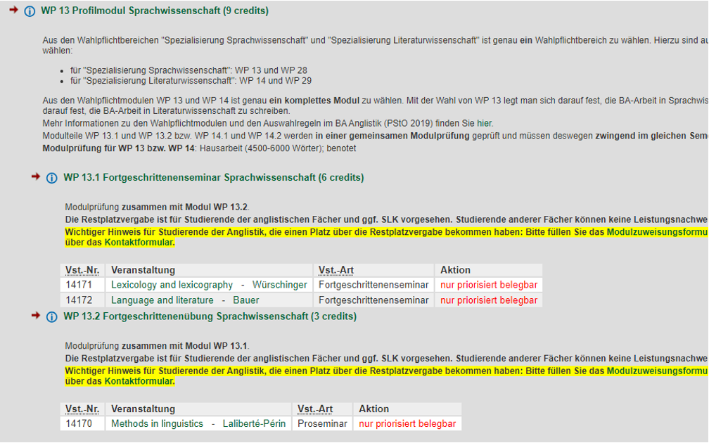

- assessment
	- {{embed ((65425def-a071-467f-81b0-e221b726abcc))}}
- Wichtige Information **nur (!)** für Studierende im **BA Anglistik (PStO 2019, Studienbeginn WiSe 2019/20 oder später)**, die diese Lehrveranstaltung als Modul WP 13.1 belegt haben:
	- Modul WP 13.1 ist nur **ein** Teil des Gesamtmoduls WP 13, das mit **einer** Gesamt-Modulprüfung (**gemeinsame Prüfung über beide Modulteile hinweg**) endet, die erfordert, dass **beide Modulteile besucht** wurden.
	- Bitte überprüfen Sie deswegen anhand der Übersicht unten und Ihres Stundenplans noch einmal, ob Sie **in diesem Semester** auch tatsächlich **eine Veranstaltung im anderen Modulteil WP 13.2** belegt haben und für diese auch **zugelassen wurden**. **Sollte dies nicht der Fall sein, wenden Sie sich bitte schnellstmöglich an die Studiengangskoordinatorin (Frau Dr. Günther: studienberatung@anglistik.uni-muenchen.de)**.
	- Die **Anmeldung zur Gesamt-Modulprüfung** erfolgt im **Prüfungsanmeldezeitraum (08. Januar 2024 bis 26. Januar 2024**). *Bitte melden Sie sich dann bei dem/der DozentIn an, bei dem/der Sie die Veranstaltung für das Modul WP 13.1 besuchen.*
	- 